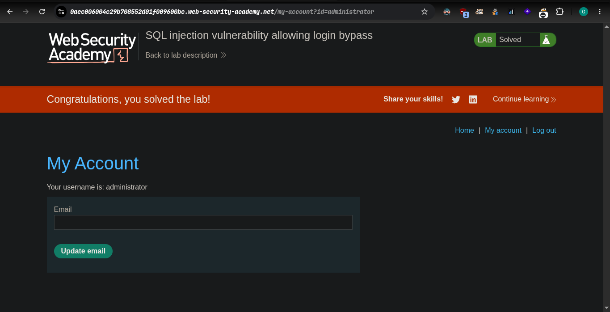

## platform `portswigger`

### target -> Lab: SQL injection vulnerability allowing login bypass

- Description: `This lab contains a SQL injection vulnerability in the login function.
To solve the lab, perform a SQL injection attack that logs in to the application as the administrator user.`

**-- where is vuln: https://0aec006004c29b708552d01f009600bc.web-security-academy.net/login**

**-- our goal: login as admin**


#### steps:
1. access the lab.
2. and notice my account then i click
3. open login page
4. simple i insert payload
5. boomb lab solve -> 


`Payload`
```sql
-- our payload
    username field -: admin
    passdword field -: ' or 1=1 --
```


+ and you target both input field in this lab 


#### automate Exploit: check exploit.py and ensure before you run your proxy is on and connect with burpsuite
