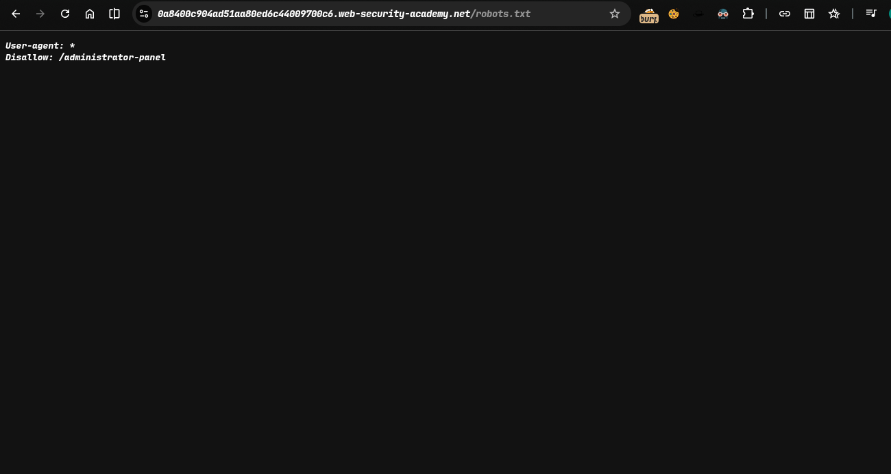
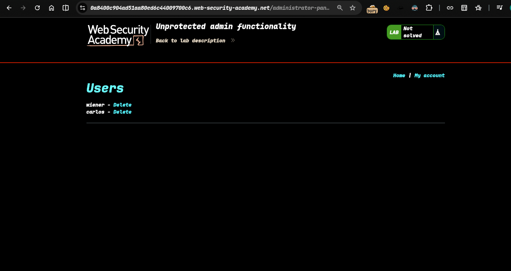
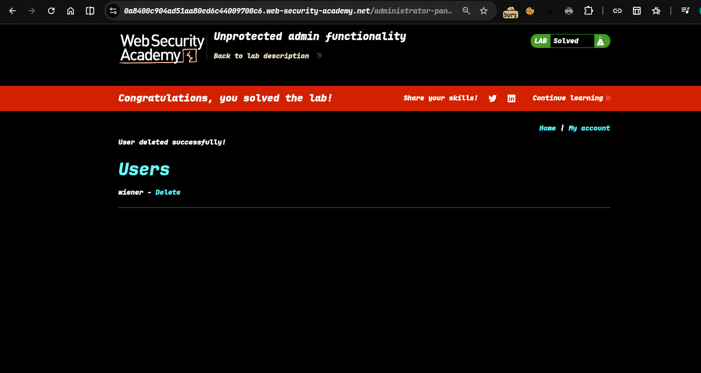

>> ### Target Lab: Unprotected admin functionality
---
**Where is Vuln**:
This lab has an unprotected admin panel.

**Goal**:
Solve the lab by deleting the user carlos.

---

## Steps:
1. open the lab..
2. find robot.txt hidden endpoint -> 
3. now i change this -> /administrator-panel ..... 
4. now i delete carlos
5. lab solve -> 

>>> Check poc.py for autmate this attack
