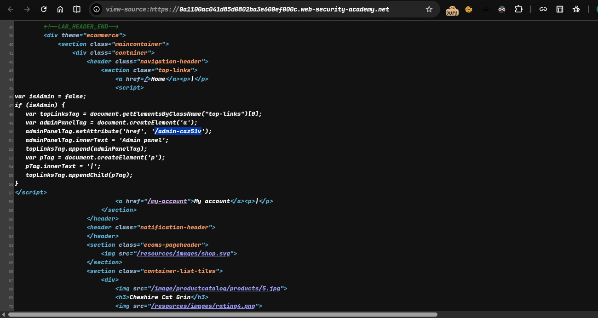
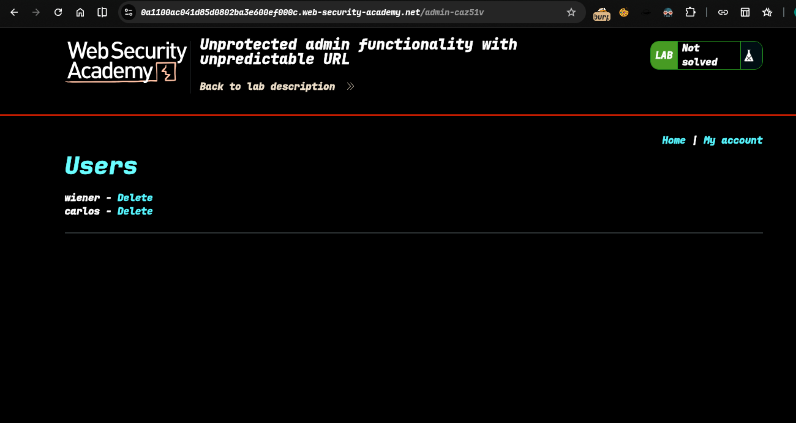
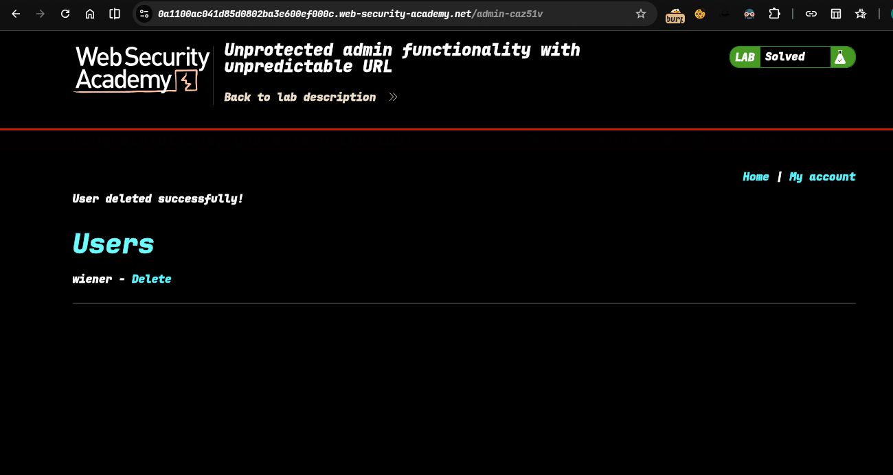

>> #### Lab: Unprotected admin functionality with unpredictable URL

----
**Where is Vuln..**:
`Url Parameter`

**Goal**:
 `access admin panel and delete carlos`

----

### Step:
1. **Open the lab..**
2. **after analyze find something in source code** 
   - `/admin-caz51v`

  
3. **lets try this**  
4. **yes it's work and delete carlos**
5. **lab solve..** 

>>> ##### Check poc.py for automate this
