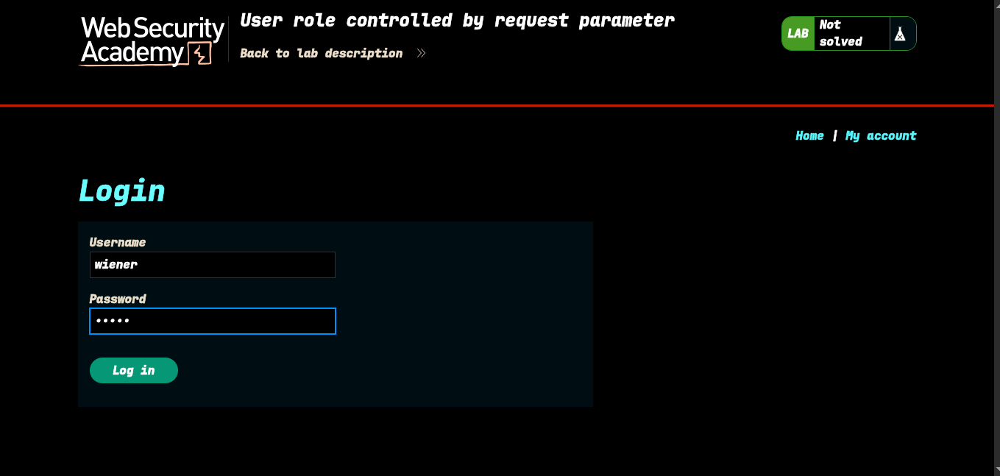
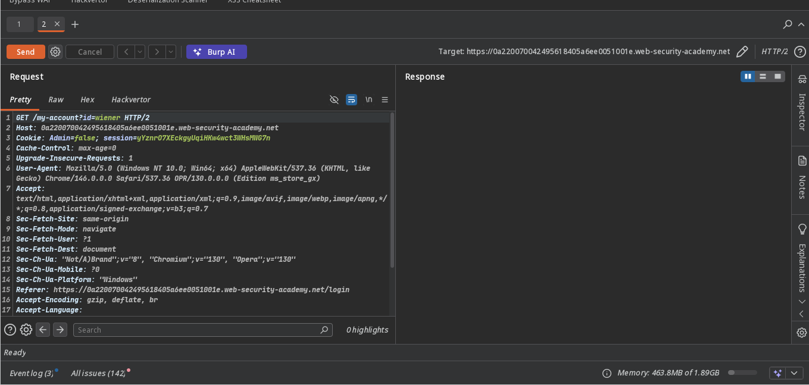
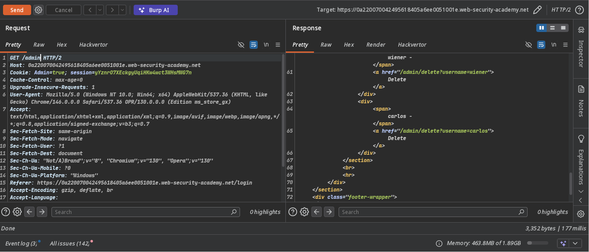
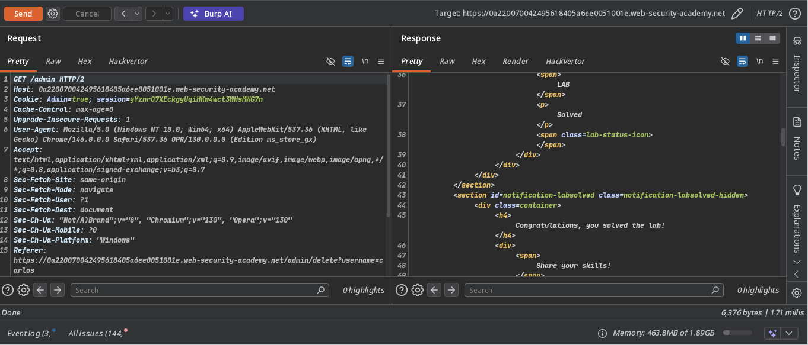
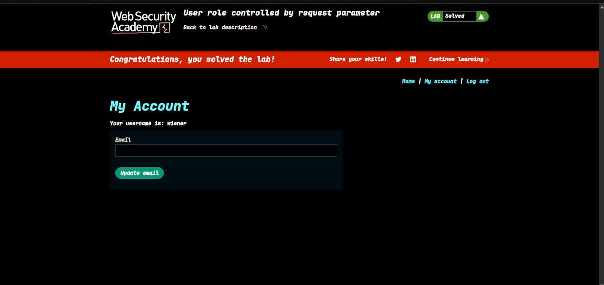

>> Target > Lab: User role controlled by request parameter

----
**Where is Vuln..**: cookie header
**Goal**: login as admin than delete carlos

-----

### Steps:
1. Open the lab and login as wiener 
2. after login, check intercept request in burp send to repeater 
3. i notice cookie Admin
4. now i change the cookie to admin true and change get parameter /admin 
5. now i delete carlos 
6. Lab solve 

>>> Check poc.py for automate this attack
