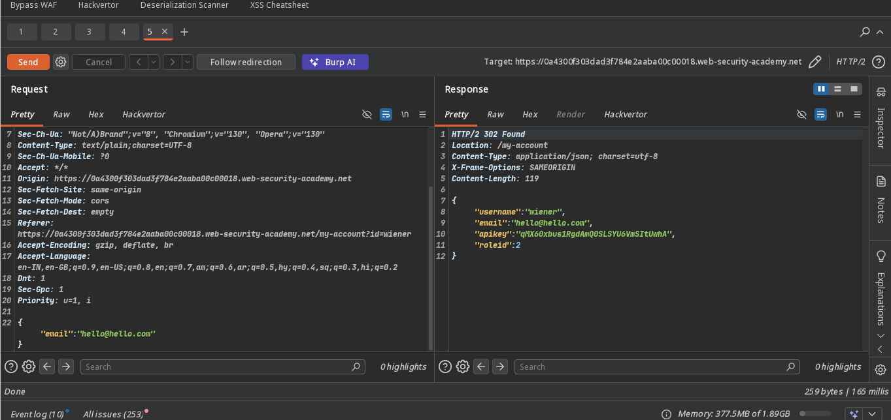
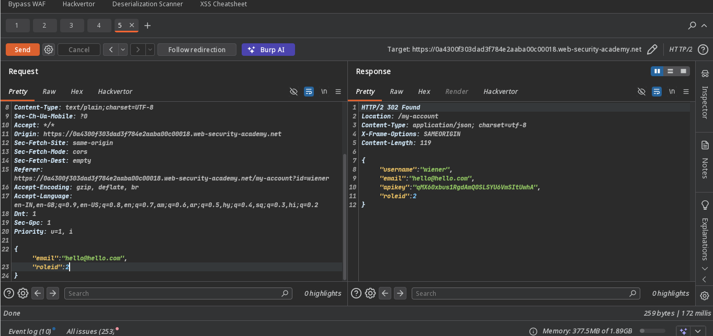
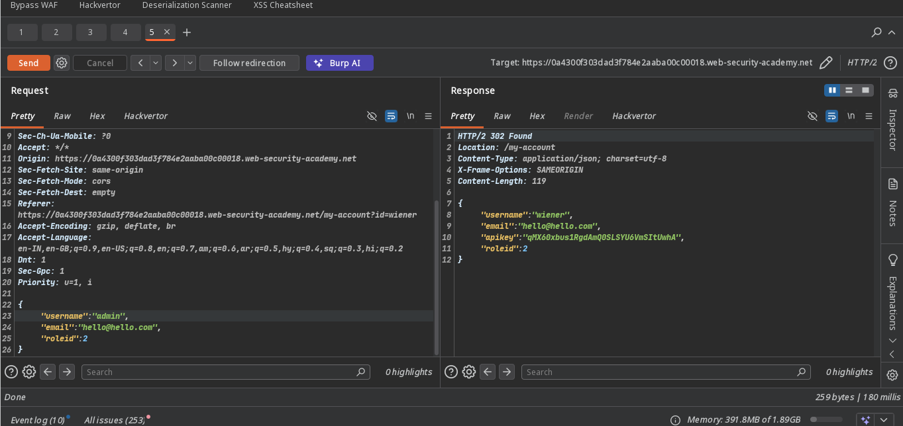
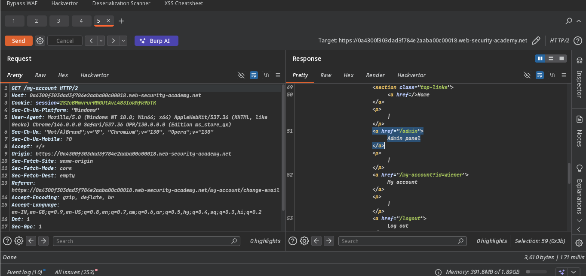
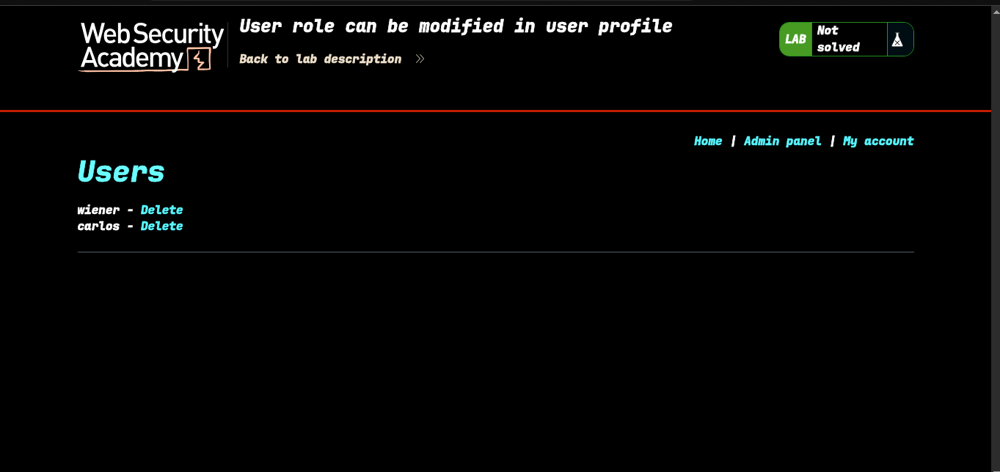
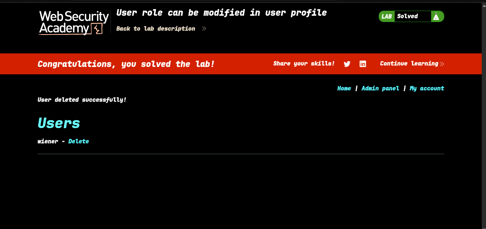

>>> Lab: User role can be modified in user profile

---
**Where Is Vuln.....**: -  Chnage email
**Goal**: - access the admin panel and delete carlos

----

### Steps:
1. Open the Lab..
2. find.. vuln endpoint our case is change-email  this -> 
3. now i try to change roleid ->  yes we can change.
4. access to admin panel >  - follow redirection..
5. see this  access the admin panel
6. refresh browser page ->  delete carlos user
7. lab solve 

#### Check poc.py for automate this script 
