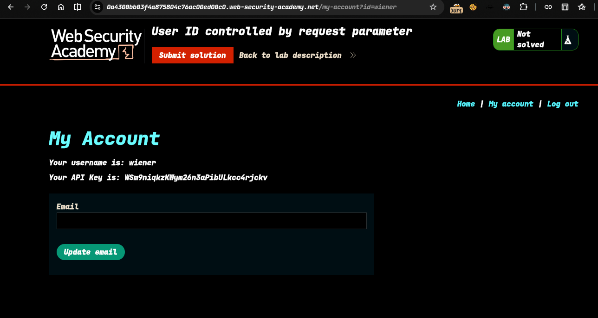
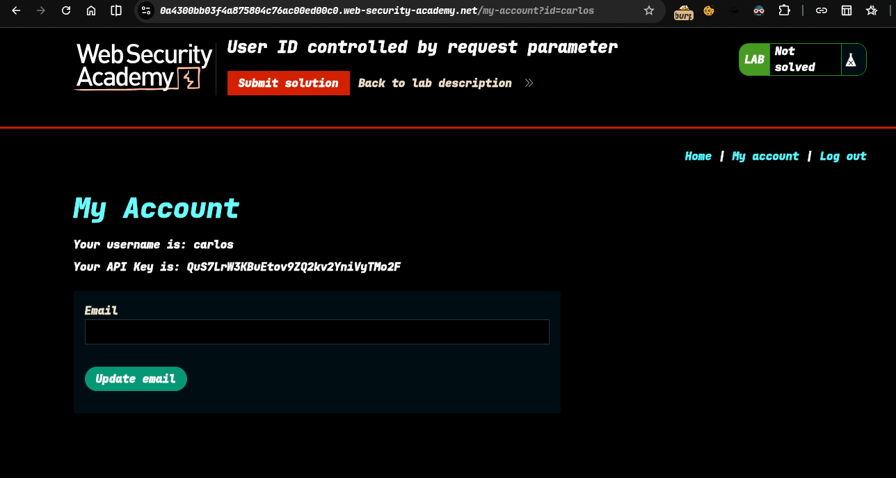
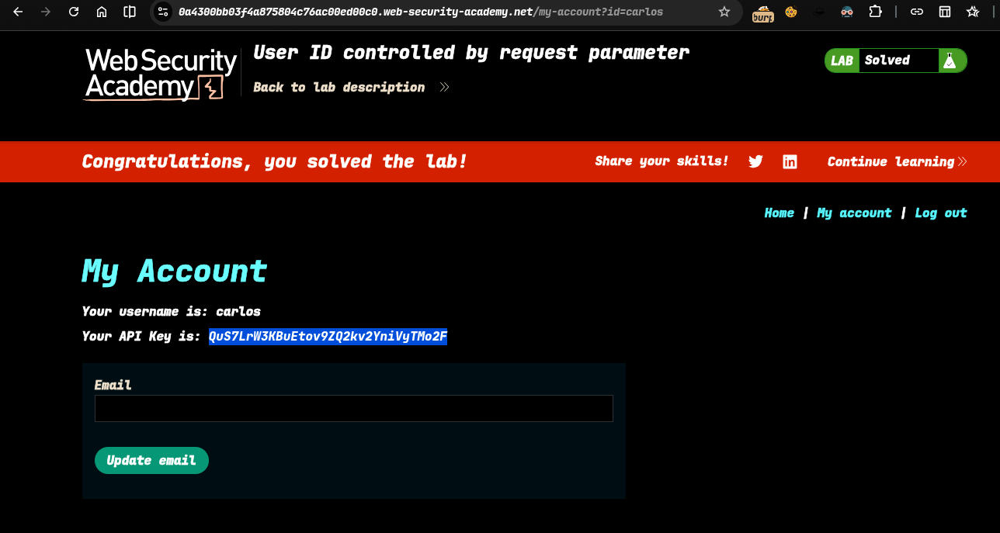

>> Target  Lab: User ID controlled by request parameter

--- 
**Where Is Vuln...**: in url id parameter.
**Goal**: obtain the API key for the user carlos and submit it as the solution

---

#### Steps
1. - Open the lab..
2. - login as wiener  
3. - i see wiener api key show in front
4. - i change url id as carlos  
5. - access the carlos account and show carlos api key  , Submit this solution
4. - now solve the lab... 

>> Check poc.py automate this attack 
