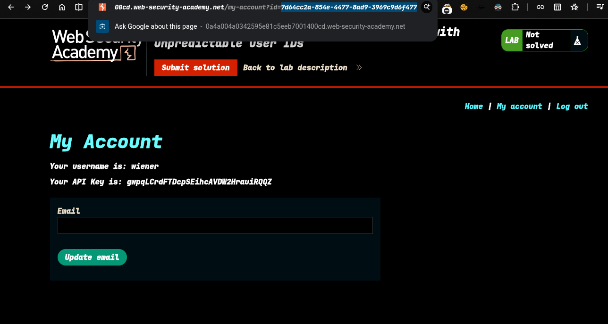
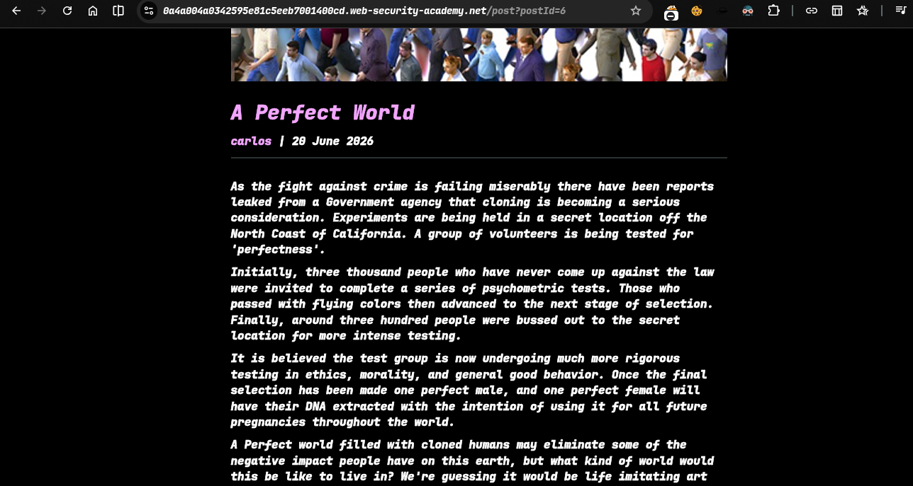
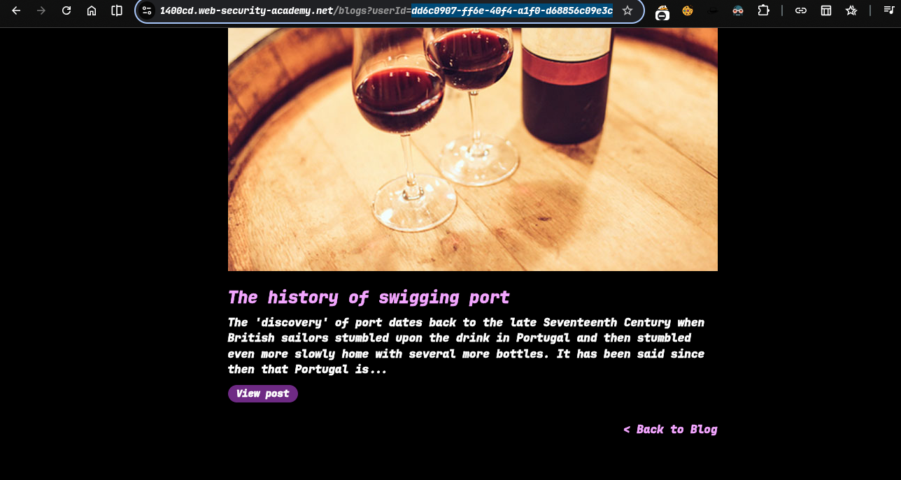
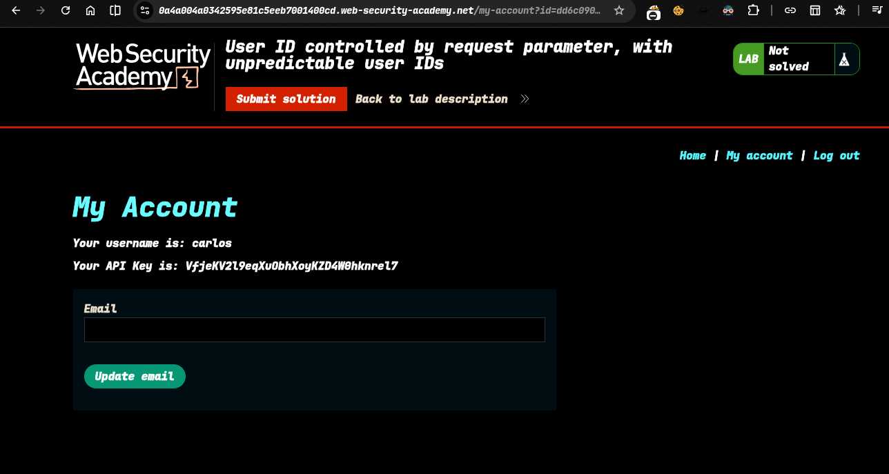
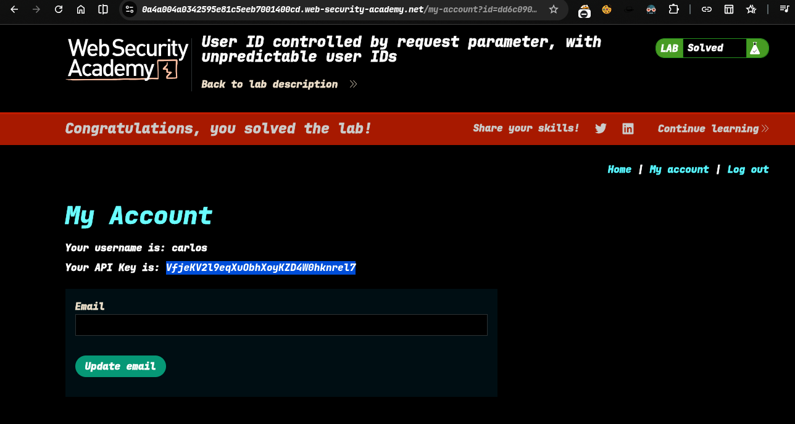

>> Target -> Lab: User ID controlled by request parameter, with unpredictable user IDs

---

**Where is Vuln**: url id parameter.

**Goal**: access the carlos account and retrieve the api key 

---

**How to reach the Goal**: 
### Steps

1. - #### Open the lab..
2. - #### login as wiener user
3. - #### i see now is unique IDs for users, so i need to find carlos id -> 
4. - #### check comments in the page and find this ->  
5. - #### click the carlos and see -> id 
6. - #### go my-account and change carlos userid get api key ->  submit this
7. - #### solve the lab..... 

## Check `poc.py` for automate attack

