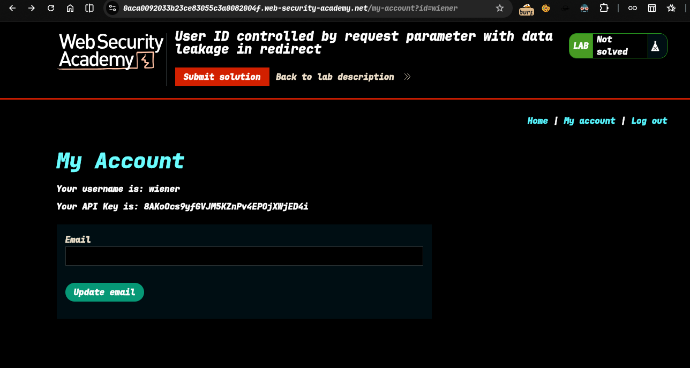
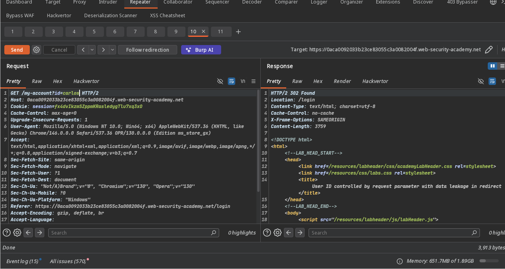
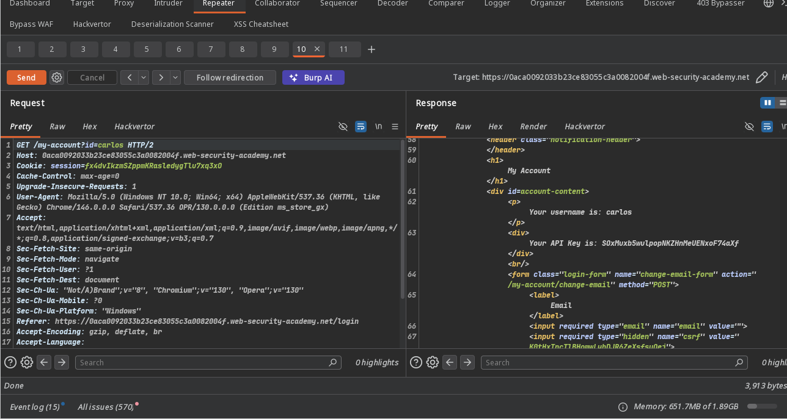
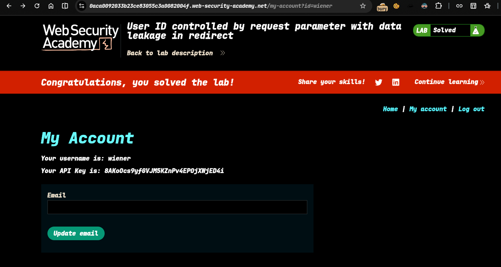

>>> Target - Lab: User ID controlled by request parameter with data leakage in redirect

---

**Where is Vuln....**: on redirection url
**Goal**: gain carlos api key

---

### Steps 
1. #### open the lab
2. #### login as wiener user -> 
3. #### capture this req.. in burp proxy
4. #### send to repeater than change user id to carlos ->  response is 302 foud 
5. #### see this  i have carlos api key submit this..
6. #### solve the lab.... 

## check `poc.py` for automate attack
