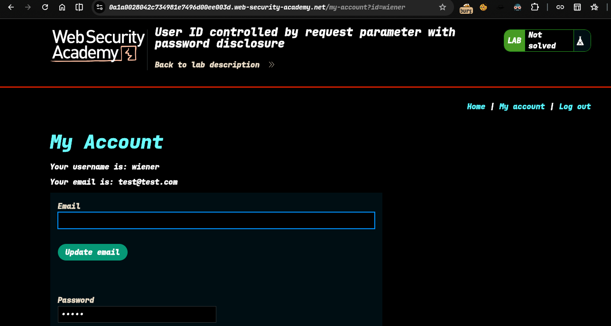
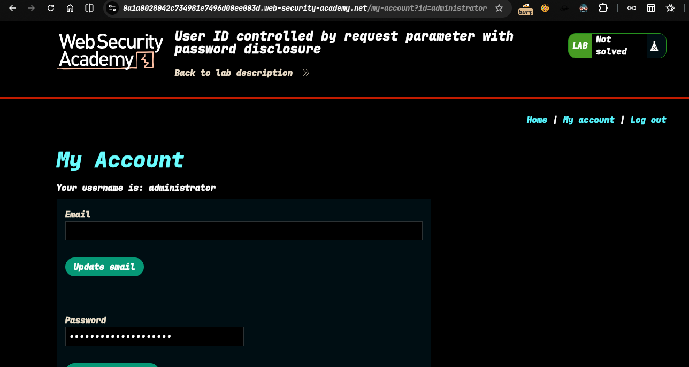
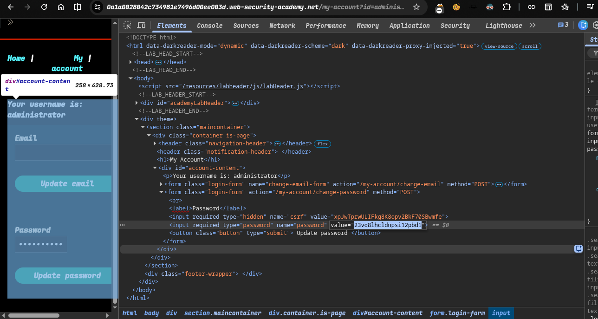
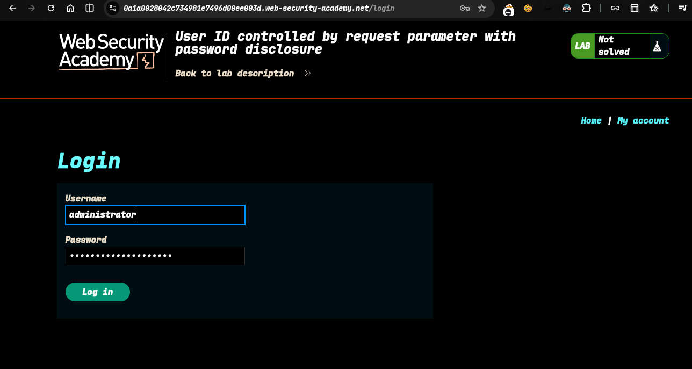
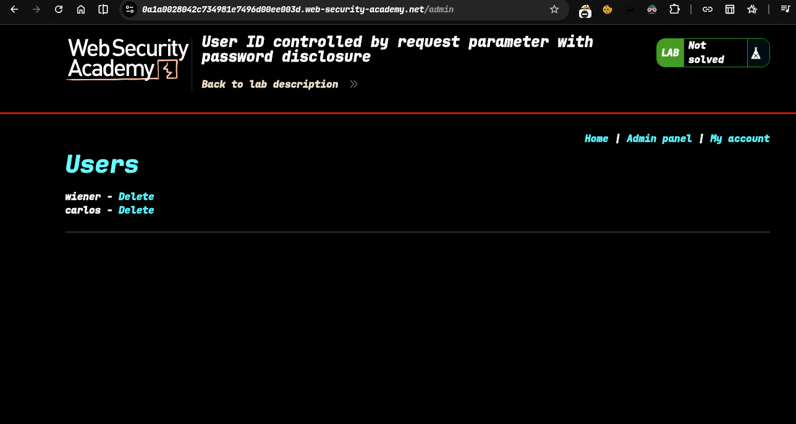
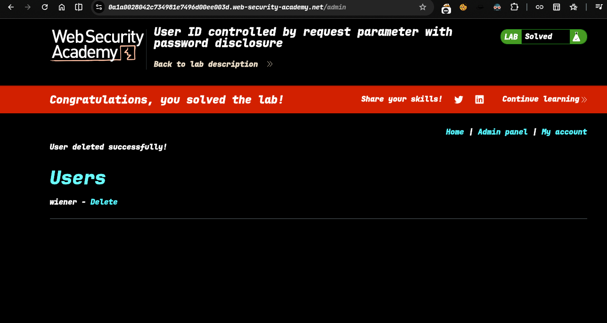

>>> Target -> Lab: User ID controlled by request parameter with password disclosure

---

**Where is Vuln..**: url user id parameter 
**Goal**: delete carlos user 

---

### Steps: 
1. Open the lab 
2. login as weiner user -> 
3. i try to change id parameter value to administrator ->  
4. now i successfully and check what is admin pass inpect element and see >  
5. login as admin -> 
6. show admin panel now delete the carlos 
7. solve the lab .... 

## Check `poc.py` for automate attack
