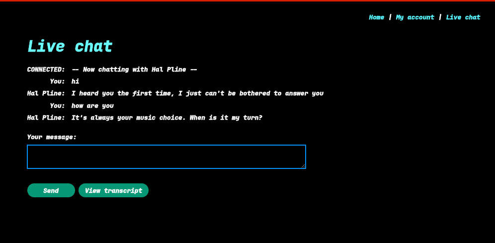
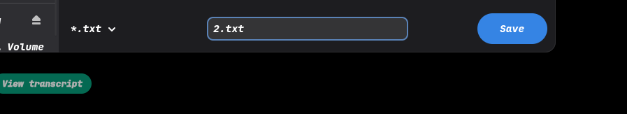
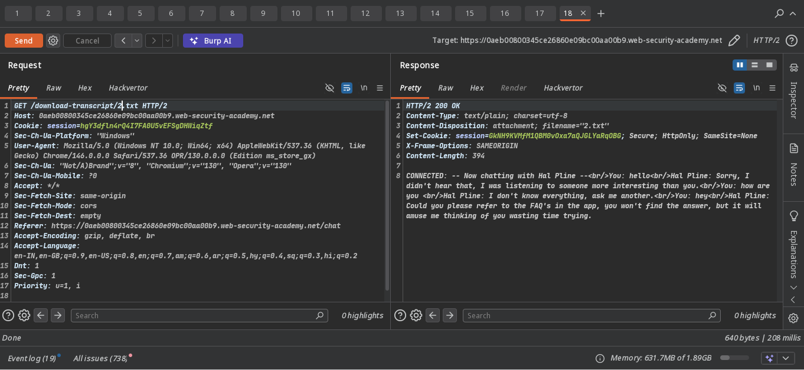
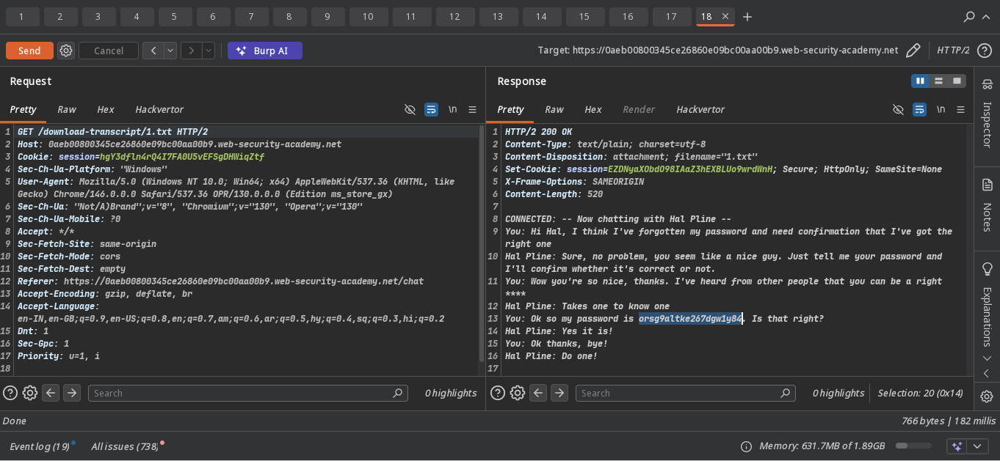
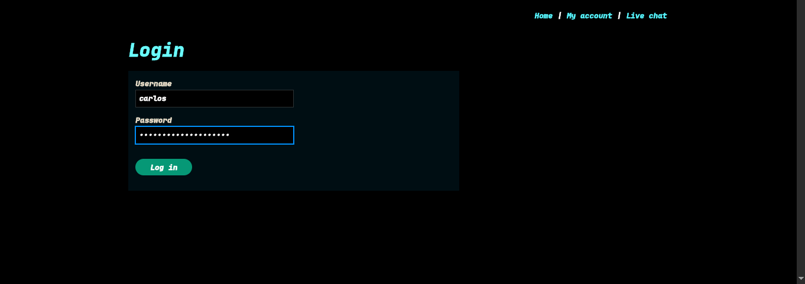
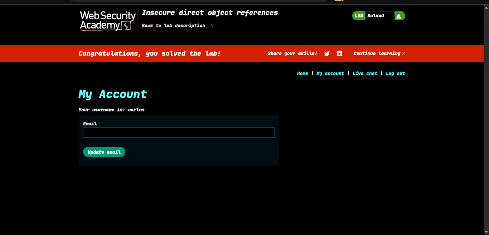

>>> Target -> Lab: Insecure direct object references (IDO) 

---

**Where Is Vuln..**: view trasncript download request
**Goal**: obtain carlos account creds and login in carlos account to win the lab 

---

---
**how to reach the goal**:

### Steps

1. - #### Open the lab..
2. - #### open the live chat and send a some messages ->  
3. - #### and click View trasncript and download 2.txt -> 
4. - #### intercept download request in burp proxy and send to repeater -> 
5. - #### see 2.txt and change this as 1.txt and now i see carlos pass -> 
4. - #### login carlos creds 
5. - #### Solve the lab... 

## check `poc.py` for automate attack
