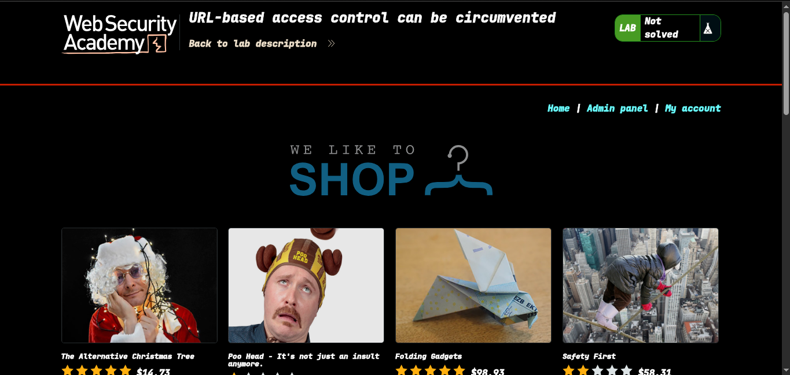
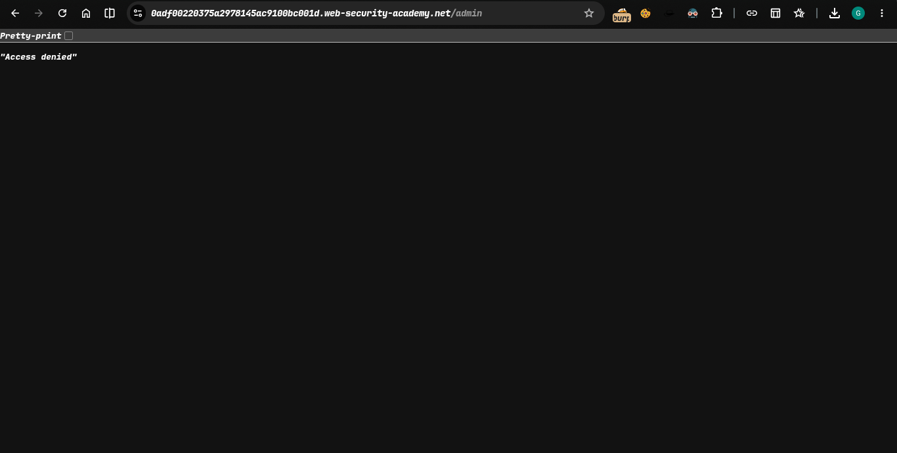
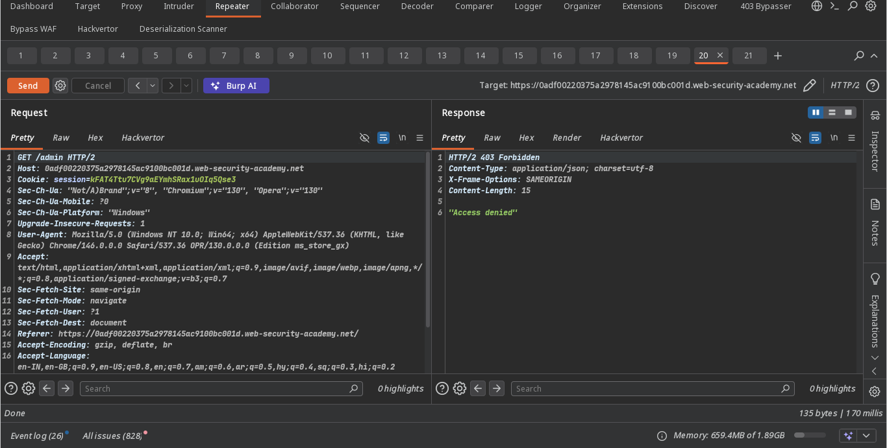
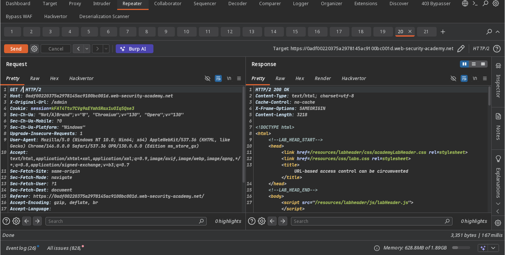
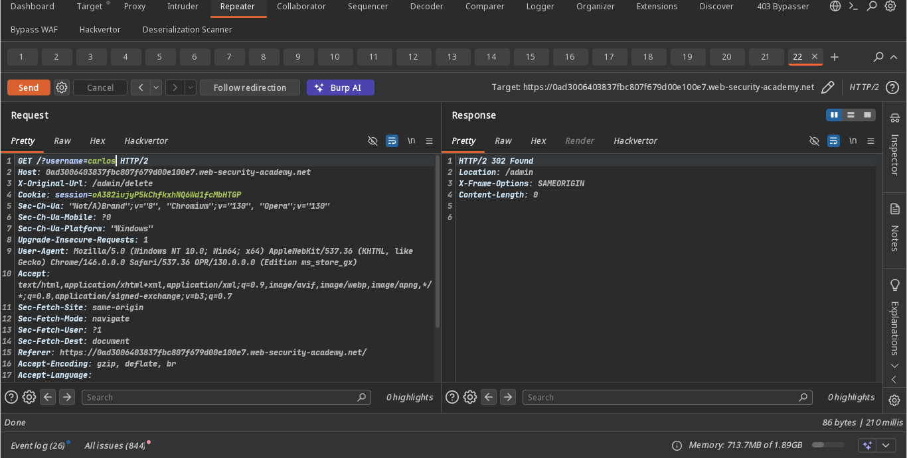
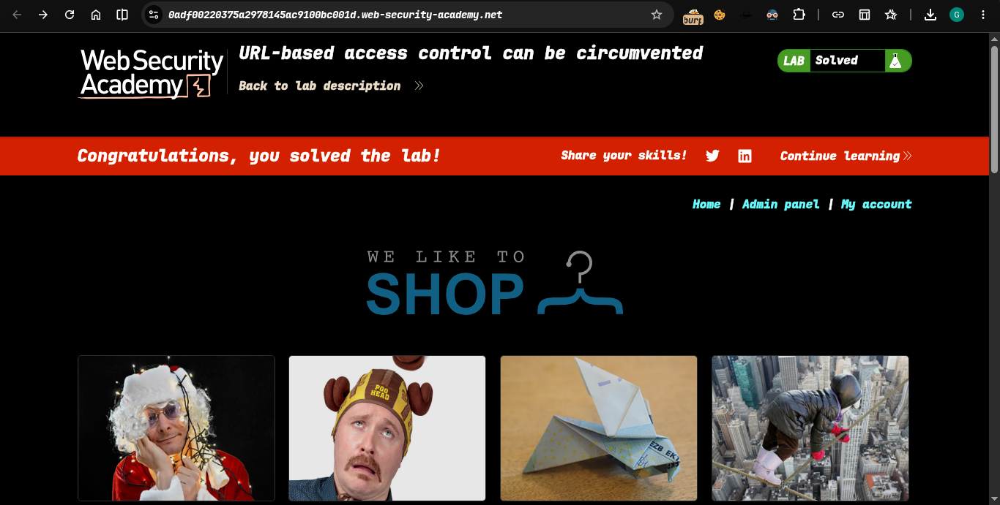

>> Lab: URL-based access control can be circumvented

---- 
**Where is Vuln..** : unauthenticated admin panel
**Goal**: access the admin panel and delete the user carlos.

----

### Steps:

1. #### open lab. already provided admin panel
2. #### click admin panel 
3. #### access denied now check in burp suite  there is also denied
4. #### add X-Original-URL header in host below and remove admin parameter in get -> 
5. #### successfully ok 200 
6. #### now delete carlos user 
7. #### solve the lab..... 

## Check `poc.py` for automate attack
