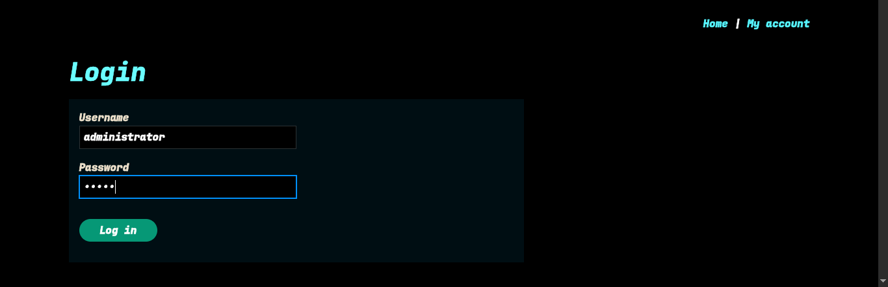
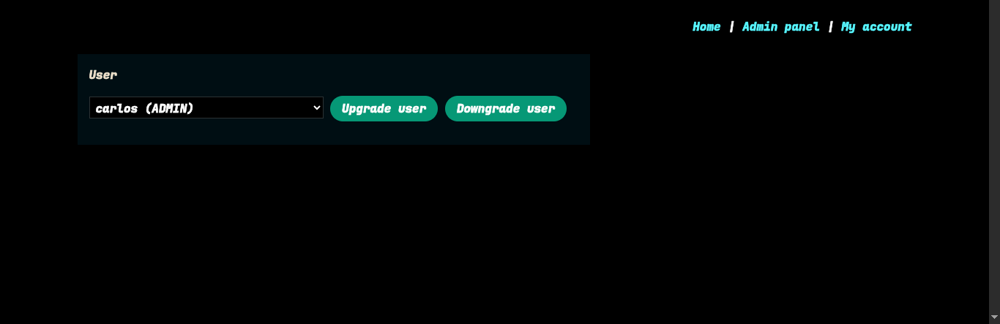
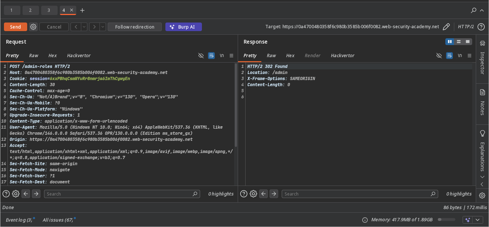
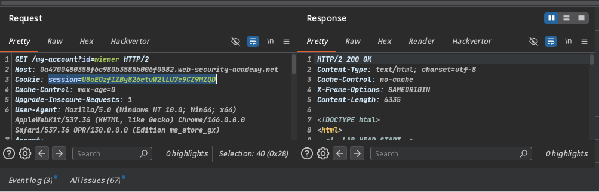
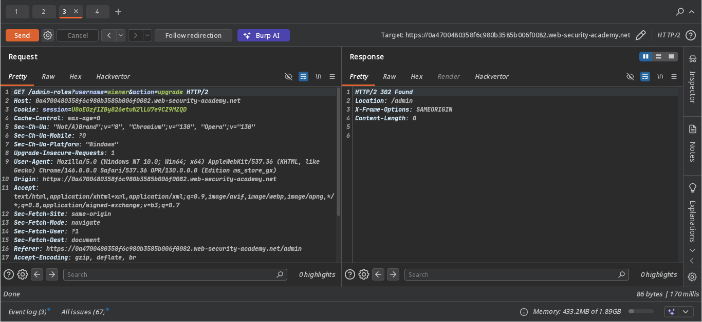
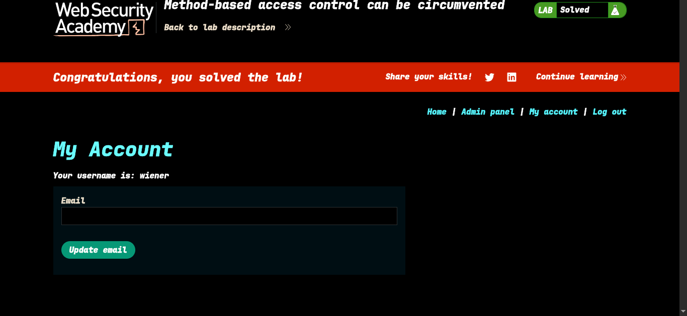

>> Lab: Method-based access control can be circumvented

----
**Vulnerability**: Admin promotion endpoint (method-based access control bypass)

**Goal**: Promote the user `wiener` to the administrator role.

---

### Steps:

1. #### Open the lab.
2. #### Log in as an administrator. 
3. #### Promote `carlos` to the admin role. -> 
4. #### Capture this promotion request in Burp Suite. -> 
5. #### Log out of the admin account, log in as `wiener`, and obtain `wiener`'s session cookie. 
6. #### Replace the session cookie in the captured admin promotion request with `wiener`'s cookie, modify the request method (e.g., from POST to GET), and send it. -> 
7. #### The lab is successfully solved, and you now have admin privileges. -> 

----

>> ### Check `poc.py` for automated exploitation

