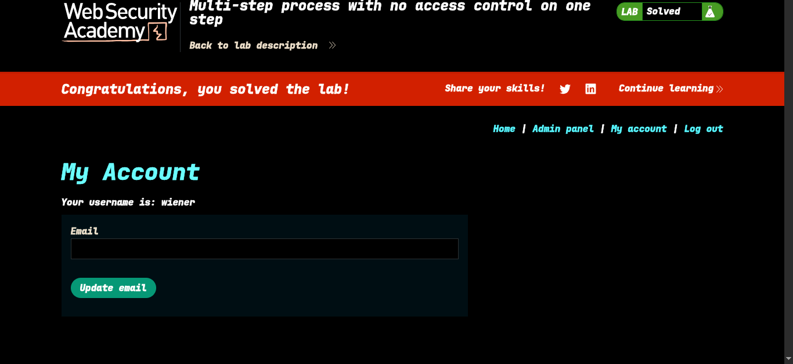

>> Lab: Multi-step process with no access control on one step

----

**Vulnerability**: in admin role 

**Goal**: Promote the user `wiener` to the administrator role.

---

> [!NOTE]
> ### Same as Lab 11 — with One Key Difference
>
> This lab follows the **exact same exploitation approach as Lab 11** (method-based access control bypass).
> The only thing to keep in mind is:
>
> > ⚠️ When upgrading `carlos` to admin as the administrator,
> > the app shows an **"Are you sure?"** confirmation step.
> > **You must capture that confirmation request** in Burp Suite — not the initial upgrade click.
> > That captured request is the one you'll replay with `wiener`'s session cookie.

---

### Steps (same as Lab 11):

1. Log in as `administrator` and navigate to the admin panel.
2. Initiate the upgrade of `carlos` → when the **"Are you sure?"** prompt appears, confirm it.
3. **Capture the confirmation request** in Burp Suite. ← _Key step_
4. Log out and log in as `wiener` — copy `wiener`'s session cookie.
5. Replace the session cookie in the captured confirmation request and send it.
6. Lab solved — `wiener` now has admin privileges.
-  

----
