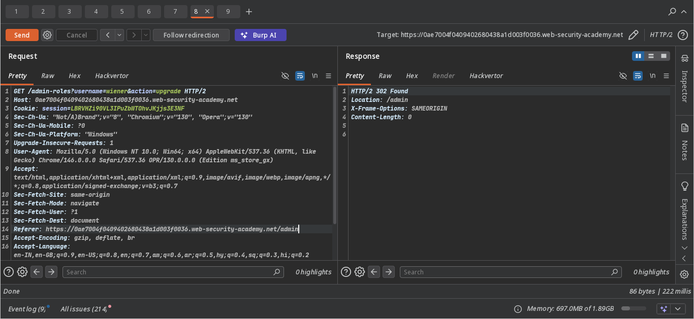

# Lab: Referer-based Access Control

**Vulnerability** — The server uses the `Referer` header to decide if an admin action is allowed.
Since `Referer` is just a browser-sent header, it can't be trusted as a security check.

**Goal** — Promote `wiener` to administrator using `wiener`'s own session.

---

## Key Insight

> This lab works **exactly like Lab 11 & 12** — same session cookie swap trick.
>
> The only difference: the server checks the `Referer` header to confirm the request
> came from `/admin`. But since we **capture the request while already on the admin panel**,
> the `Referer` is already set correctly — no need to touch it at all.
>
> Just swap the session cookie. That's it.

---

## Steps

1. Log in as `administrator` → go to the Admin Panel.
2. Promote `carlos` to admin and **capture that request in Burp Suite**.
3. Log out → log in as `wiener` → grab `wiener`'s session cookie.
4. In Burp, replay the captured request:
   - Replace the session cookie with `wiener`'s cookie and replace username -> 
   - Leave the `Referer` header exactly as captured ✅
5. Send — lab solved, `wiener` is now admin. 

---