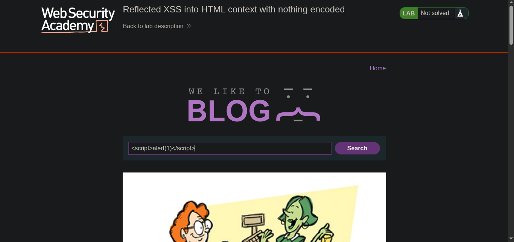
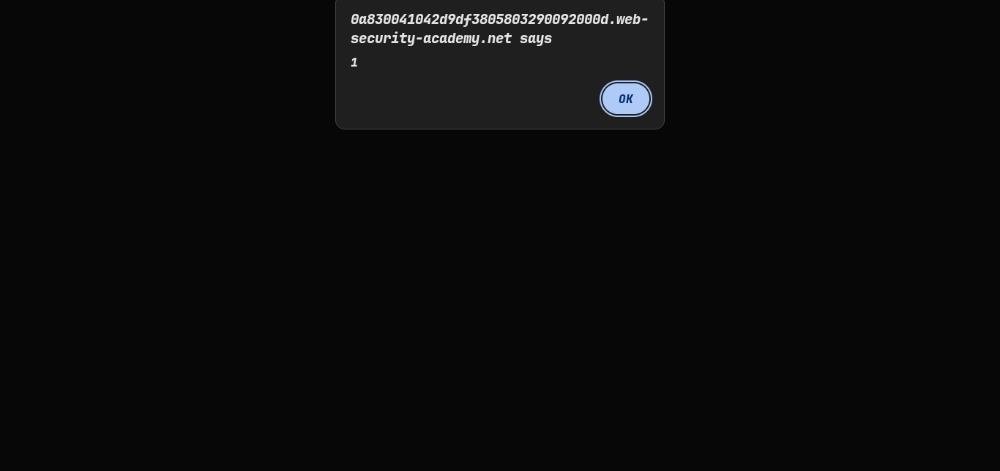
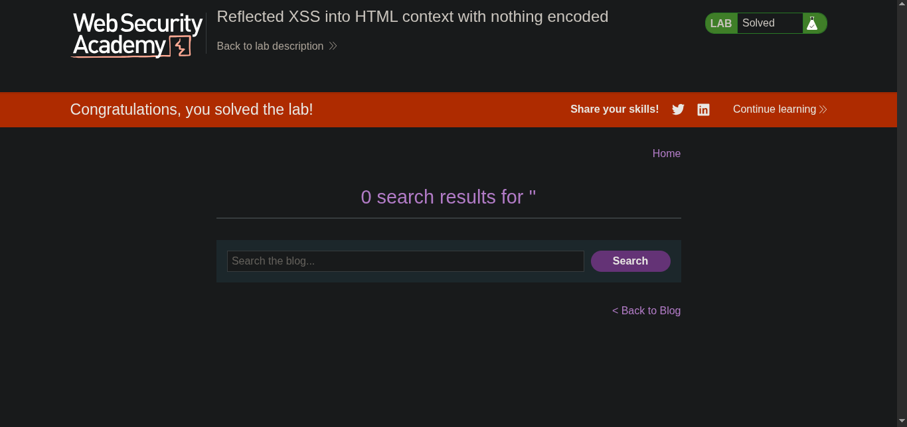

> // platform -> PortSwigger

> ## Target -> Lab: Reflected XSS into HTML context with nothing encoded

> ---
>
> **Where is Vulnerability: in search parameter**
> **Goal: Simple alert**

> ---

### Steps:

1. Open the lab in your browser.
2. In the search field, enter the following payload: 
3. payload:

```javascript
<script>alert(1)</script>
```

4. Click the search button.
5. You should see an alert box pop up with the number 1, indicating that the reflected XSS vulnerability has been successfully exploited. 

---
6. solve the lab. 

---

> ### `Which Type of XSS IS : Reflected XSS`
