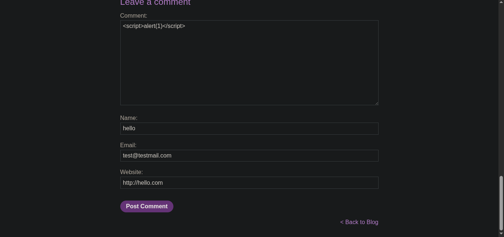
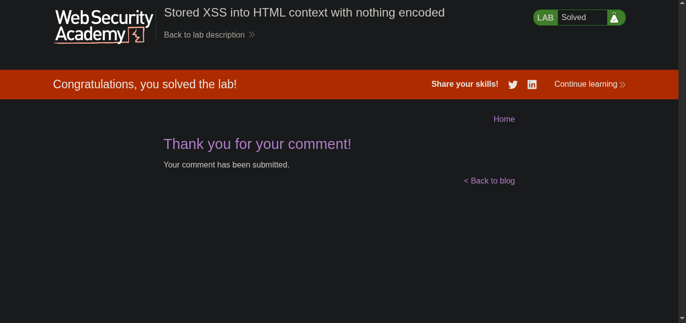

> //platform -> PortSwigger
> ### Target -> Lab: Stored XSS into HTML context with nothing encoded

---
**Where is Vulnerability: blog post comment field**
**Goal: Simple alert**

---

## Steps:
1. Open the lab in your browser.
2. Navigate to the blog post page.
3. In the comment field, enter the following payload:
```javascript
<script>alert(1)</script>
```
4. Submit the comment. 
5.  You should see an alert box pop up with the number 1, indicating that the stored XSS vulnerability has been successfully exploited.
6. Solve the lab. 

> ### `Which Type of XSS IS : Stored XSS`
