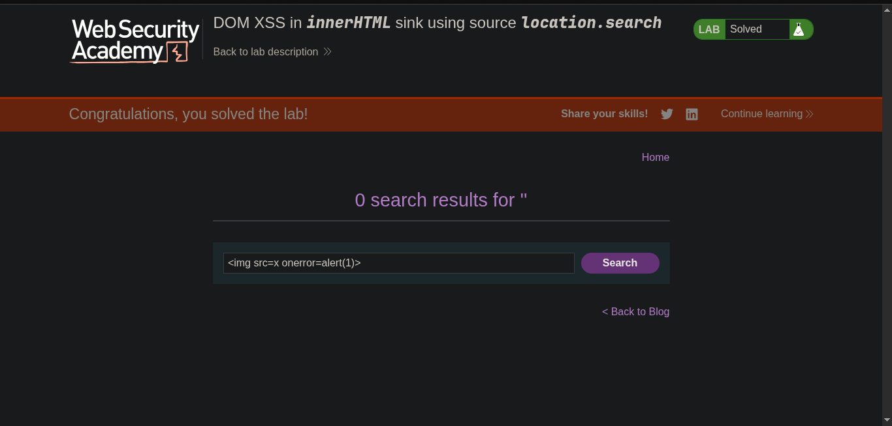
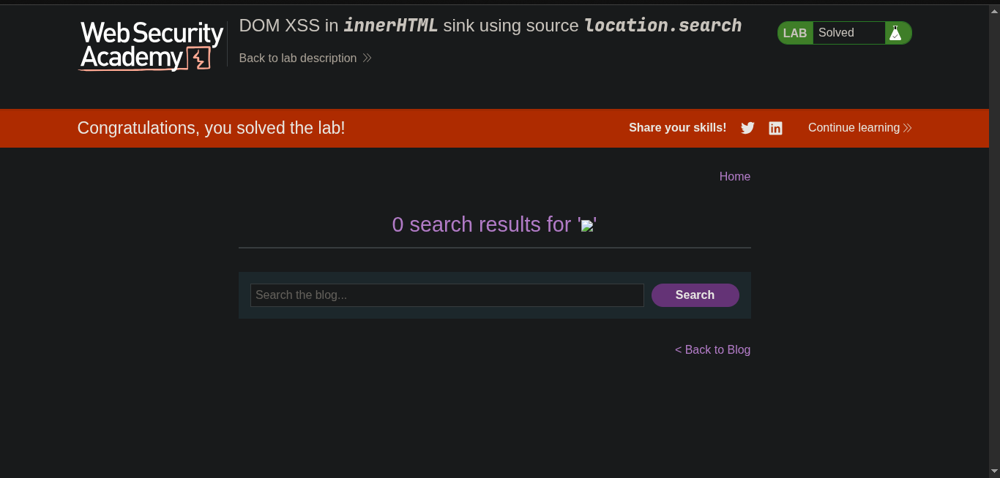

> // platform -> PortSwigger
> ## Target -> Lab: DOM XSS in innerHTML sink using source location.search

---
****Where is Vulnerability: in search parameter**
**Goal: Simple alert**

---

### Steps:
1. Open the lab in your browser.
2. In the search field, enter the alert payload normal <script>alert(1)</script> nothing work
3. bcz the lab is vulnerable to DOM XSS in innerHTML sink using source location.search, so we need to use the following payload:

```html

<span>
 '
</span>
</h1>
<script>
function doSearchQuery(query) {
document.getElementById('searchMessage').innerHTML = query;
}
var query = (new URLSearchParams(window.location.search)).get('search');
if(query) {
doSearchQuery(query);
}
</script>
```

4. this payload will break the current HTML structure and inject a script tag that executes an alert with the number 1.
5. use the following payload in the search parameter: 

```html

```
6. solve the lab.  
