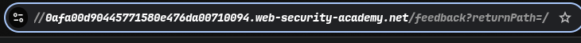
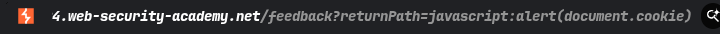
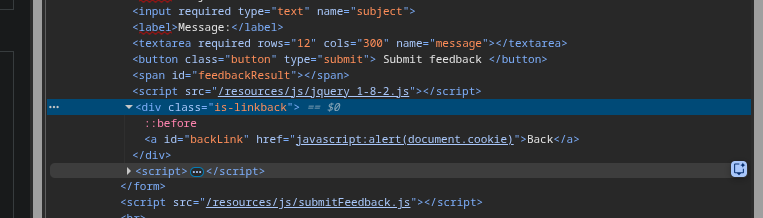
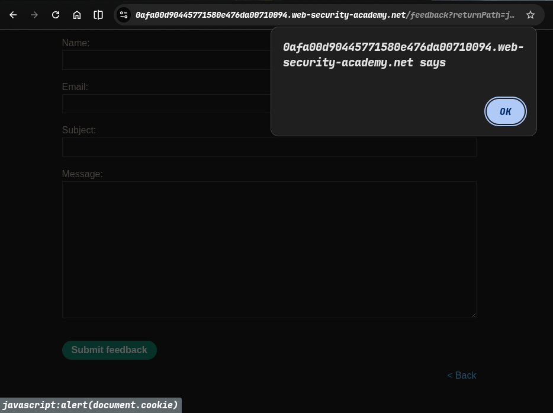
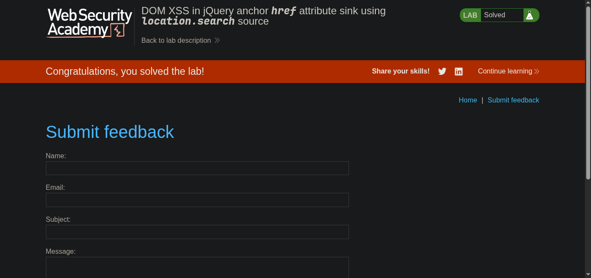

> // platform -> PortSwigger
> ## Target ->  Lab: DOM XSS in jQuery anchor href attribute sink using location.search source

---
**Where is Vulnerability: in submit feedback parameter /feedback?returnPath=?**
**Goal: make alert(document.cookie)**

---

## Steps:
1. > Open the lab in your browser.
2. > In the feedback form, enter the following payload in the "Return Path" field:
```javascript
javascript:alert(document.cookie) // in the href attribute of the anchor tag, this will execute the alert with the document cookie
```
> 
> 

3. > after hit this now back button click...
4. > lab solve. 
