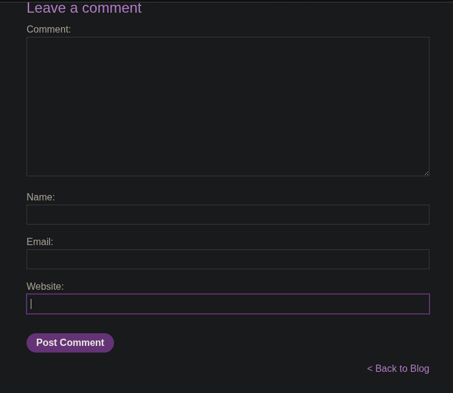
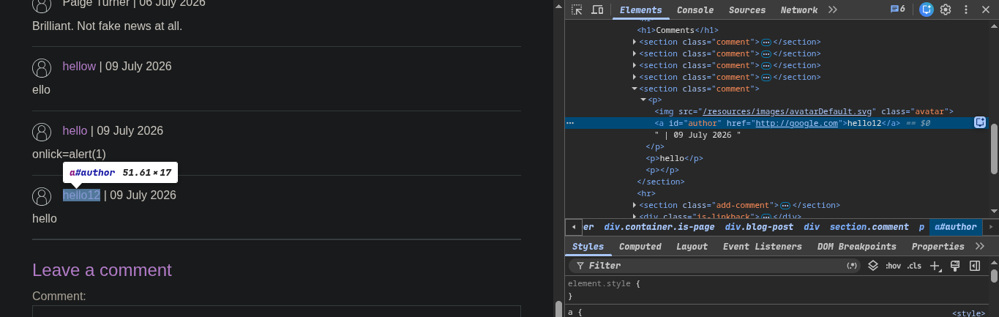
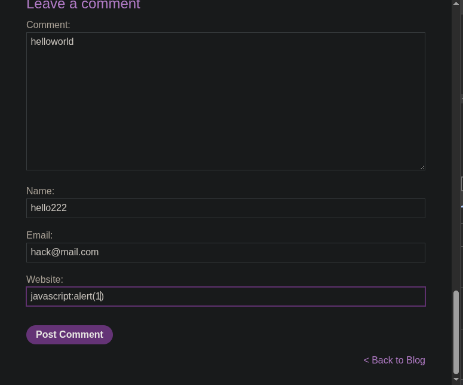
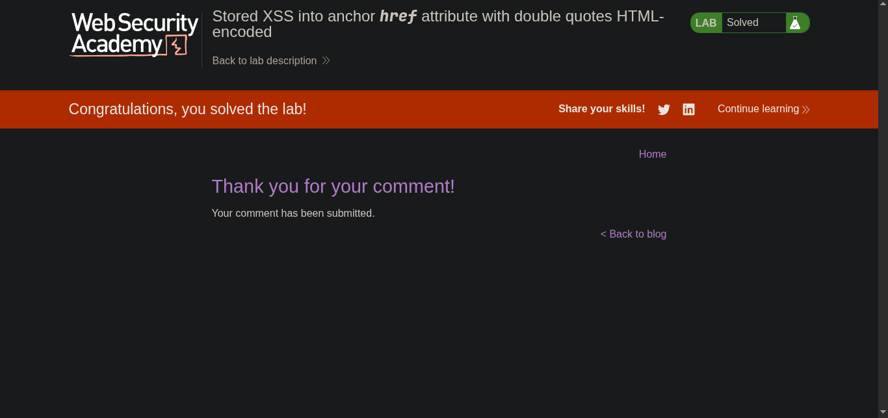

> platform -> PortSwigger
> Target ->  Lab: Stored XSS into anchor href attribute with double quotes HTML-encoded
----
*where is Vulnerability: in comment field website field* 
*Goal:alert*

---

#### Steps:
1. Open the lab in your browser.
2. Navigate to the blog post page.
3. In the comment field, enter the following payload in the "Website" field.
4. vulnerabilty 
5.  -> `href` attribute contains `javascript:alert(1)` -> clicking triggers execution of `alert(1)`.
6. solve the lab 
