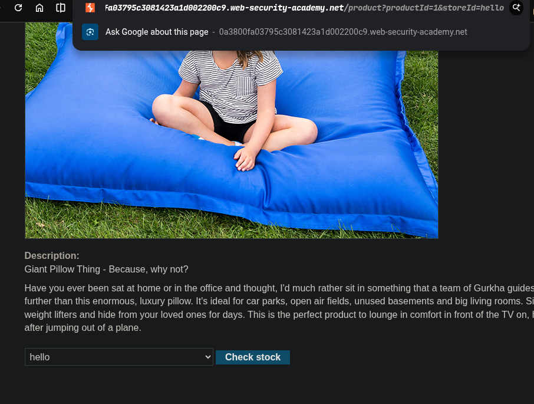
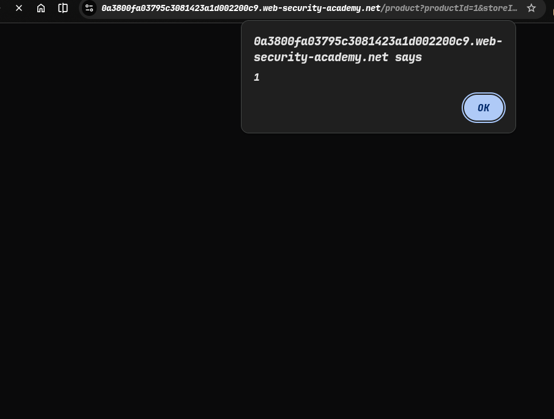
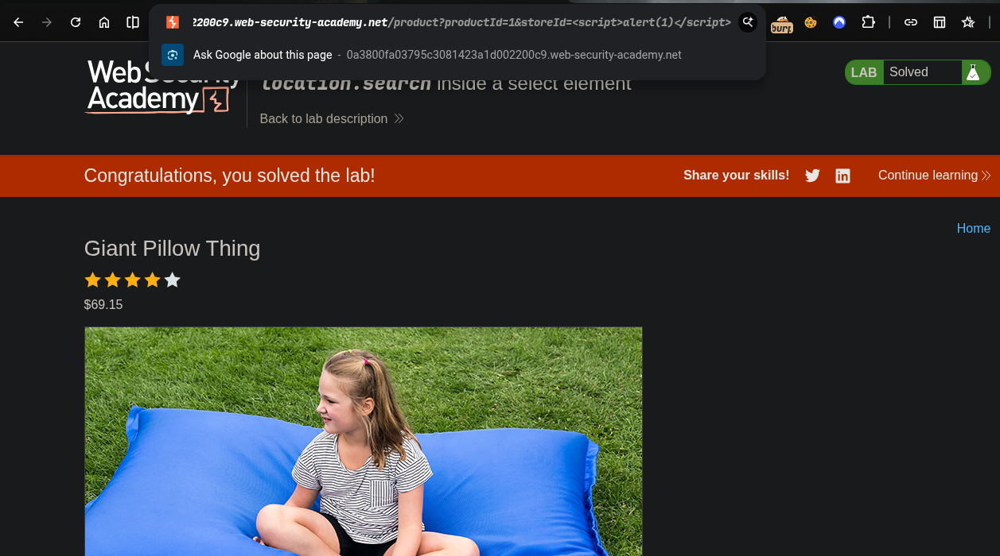

> platform -> PortSwigger
> Target -> Lab: Lab: DOM XSS in document.write sink using source location.search inside a select element
---
- **where is Vulnerability:in stockid**
- **Goal:call alert**
---

### Steps:
1. Open the lab in your browser.
2. and check stock id parameter.
3. lets change the stock id parameter ->  `&` use for next parameter
4. yes i will change stockID
5. Exploitation -
```javascript
<script>alert(1)</script>
```
6.  hit.
7.  successfully executed the alert(1) function

