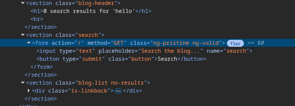
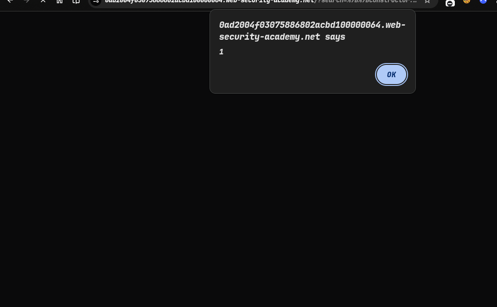
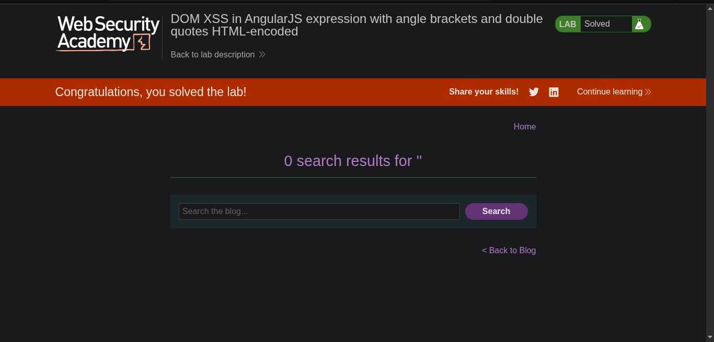

> platform -> PortSwigger
> ### Target -> Lab: DOM XSS in AngularJS expression with angle brackets and double quotes HTML-encoded

---
- **where is Vulnerability: in search field to angularJs**
- **Goal use angularJs expression triggered alert(1)**


---

### Steps:
1. Open the lab in your browser.
2. and check the search parameter.
3.  pass simple hello and check the output.
4.  out in anguarJs expression is `{{hello}}` and it will print hello in the output.
5.  now try angularJs expression to trigger alert(1) function
```javascript
{{constructor.constructor('alert(1)')()}}
```
---------
`Payload explain`
- {{...}} ->  Template engine expression syntax
- constructor.constructor ->  constructor of the constructor function is the Function constructor, which allows you to create new functions dynamically.
- 'alert(1)' ->  trigger the alert function with the argument 1

-------
6. after the execute solve the lab successfully -> 
-  
