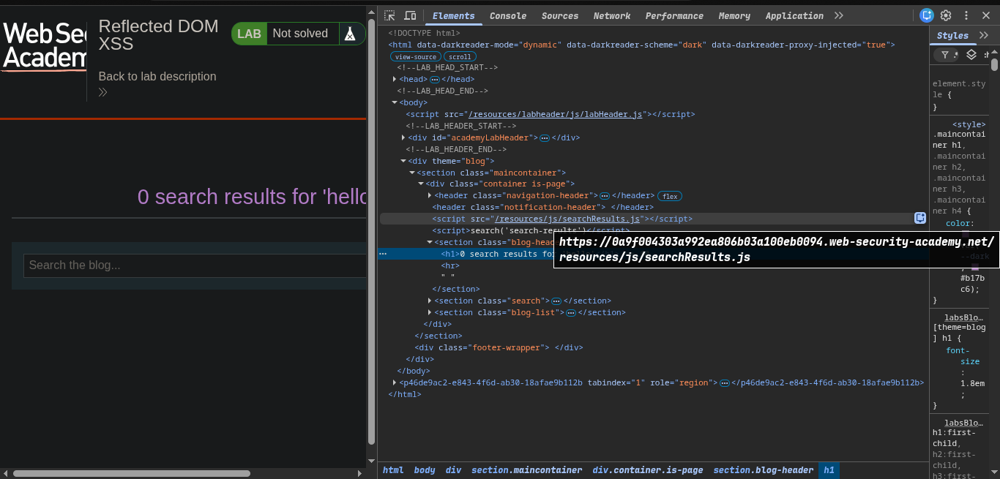
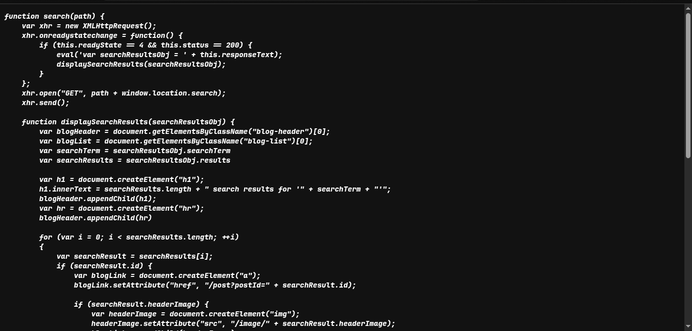
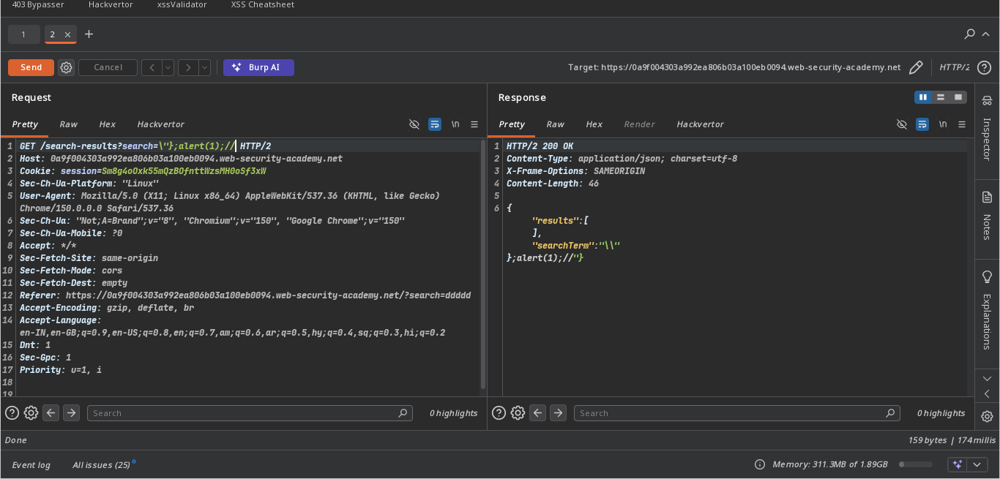

# PortSwigger

## Lab: Reflected DOM XSS

### Vulnerability

The application passes a server response containing user-controlled input to `eval()`. Because `eval()` interprets its input as JavaScript, an attacker can break out of the expected data structure and execute arbitrary code in the browser.

### Goal

Trigger `alert(1)` through the search functionality to complete the lab.

### Steps

1. Open the lab in a browser.

2. Search for a harmless value such as `hello`. Notice how the search term is reflected in the response.

   

3. Inspect the relevant JavaScript file. The vulnerable sink is:

   ```js
   eval('var searchResultsObj = ' + this.responseText);
   ```

   `this.responseText` includes the search value. Passing it directly to `eval()` causes the browser to treat response data as executable JavaScript.

   

4. Enter the following payload in the search field:

   ```text
   \"};alert(1);//
   ```

   Payload breakdown:

   - `\"` handles the escaped quotation mark in the reflected value.
   - `}` closes the existing object structure.
   - `;alert(1);` adds and executes a new JavaScript statement.
   - `//` comments out the remaining generated code, preventing a syntax error.

5. Submit the search. The injected code executes and displays an alert.

   

6. The lab is solved.

### Secure Alternative

If the response is JSON, parse it as data instead of executing it:

```js
const searchResultsObj = JSON.parse(this.responseText);
```
