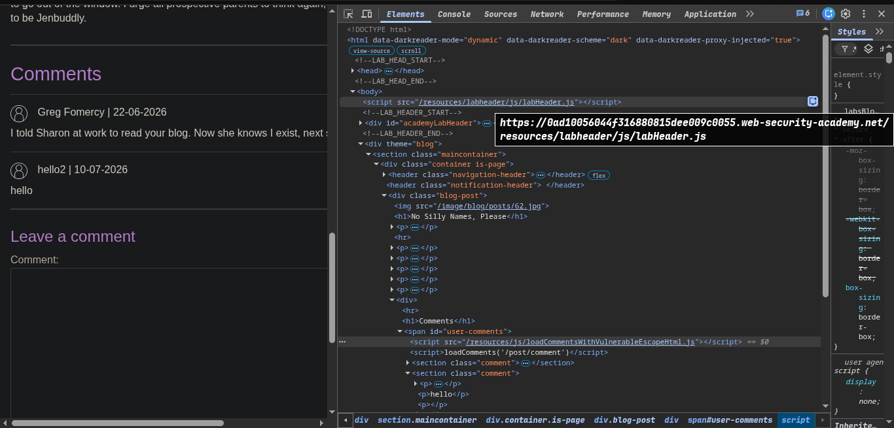
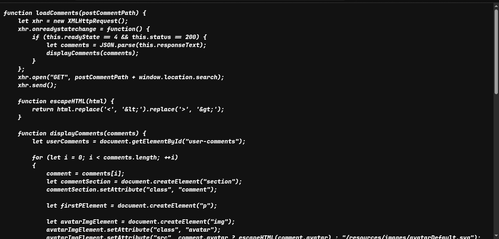
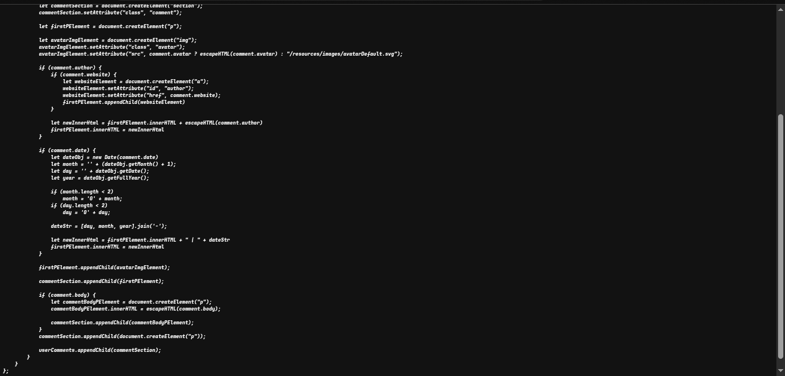
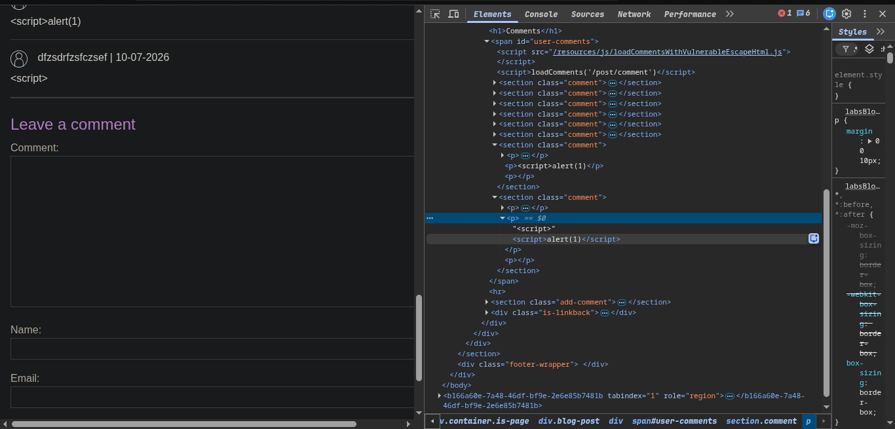
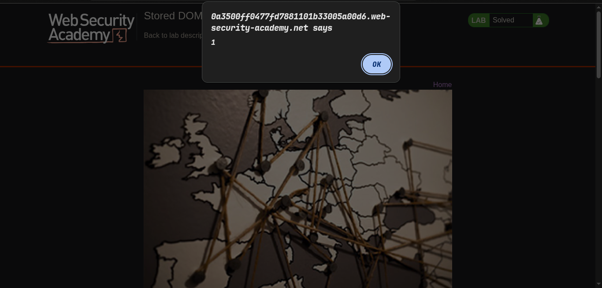

# PortSwigger

## Lab: Stored DOM XSS

### Vulnerability

Blog comments are fetched and inserted into the page with `innerHTML`. The custom `escapeHTML()` function only escapes the first `<` and `>` characters, so later HTML in a stored comment remains active.

### Goal

Trigger `alert(1)` from a stored blog comment.

### Workflow

1. Open a blog post and submit a harmless comment. Inspect the page and the JavaScript responsible for loading comments.

   

2. The script retrieves comments, then renders the comment body using:

   ```js
   commentBodyPElement.innerHTML = escapeHTML(comment.body);
   ```

   

   

3. `escapeHTML()` is incomplete because `String.replace()` without a global regular expression replaces only the first occurrence of each character:

   ```js
   function escapeHTML(html) {
     return html.replace('<', '&lt;').replace('>', '&gt;');
   }
   ```

4. Submit this comment payload:

   ```html
   <script>
   ```

   The first `<script>` tag is rendered as harmless text after escaping. The following `` tag is not fully escaped, however, and is parsed by `innerHTML`. Its invalid `src` triggers the `onerror` handler, which executes `alert(1)`.

   

5. Reload or view the post. The stored payload executes when the comment is rendered.

   

The lab is solved.

### Secure Approach

Render untrusted text with `textContent` rather than `innerHTML`:

```js
commentBodyPElement.textContent = comment.body;
```
