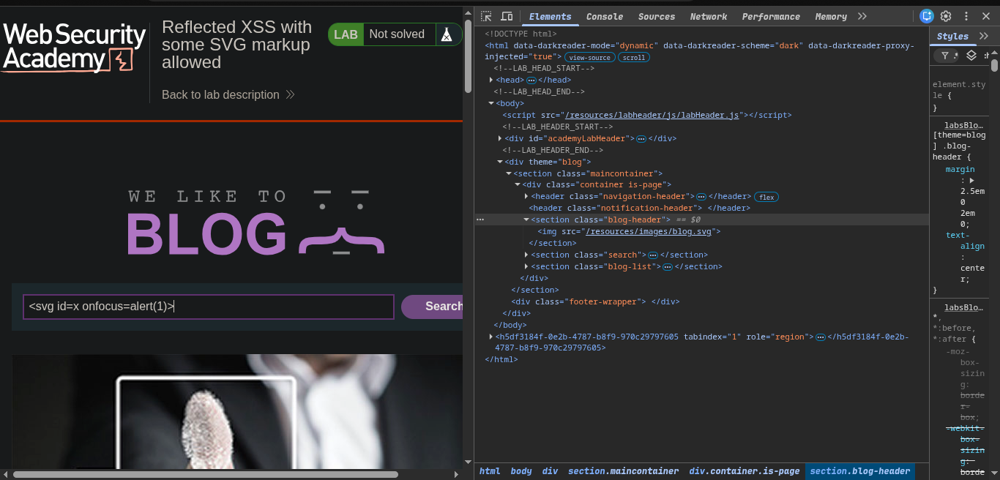
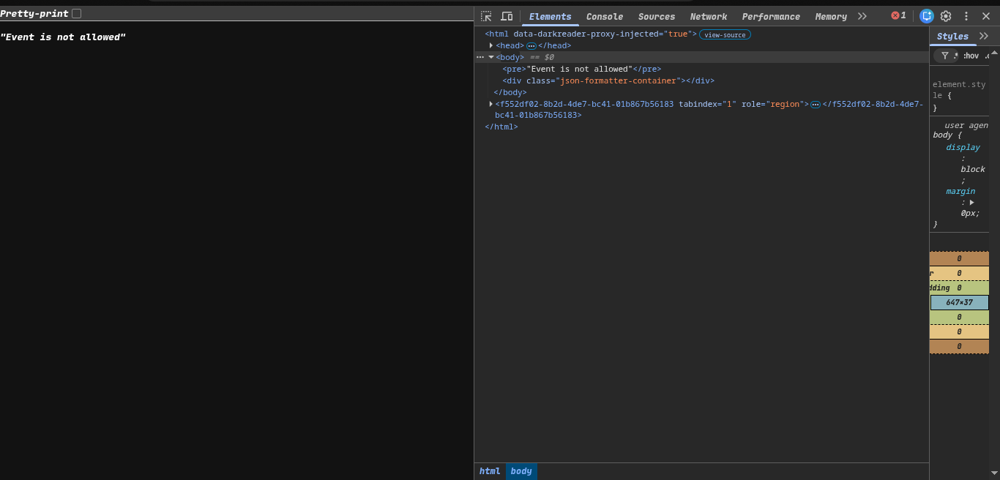
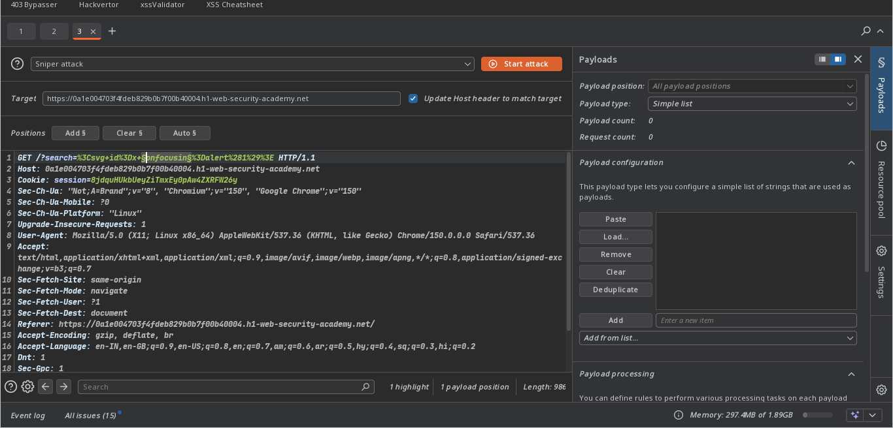
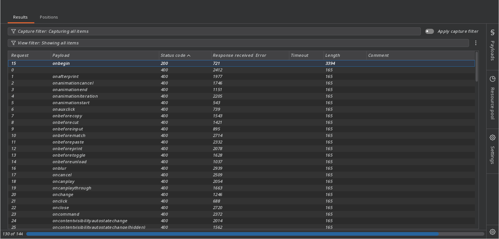
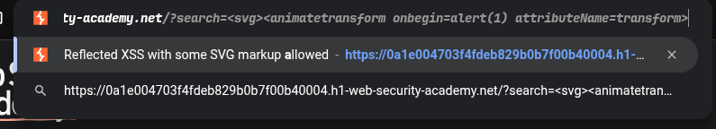
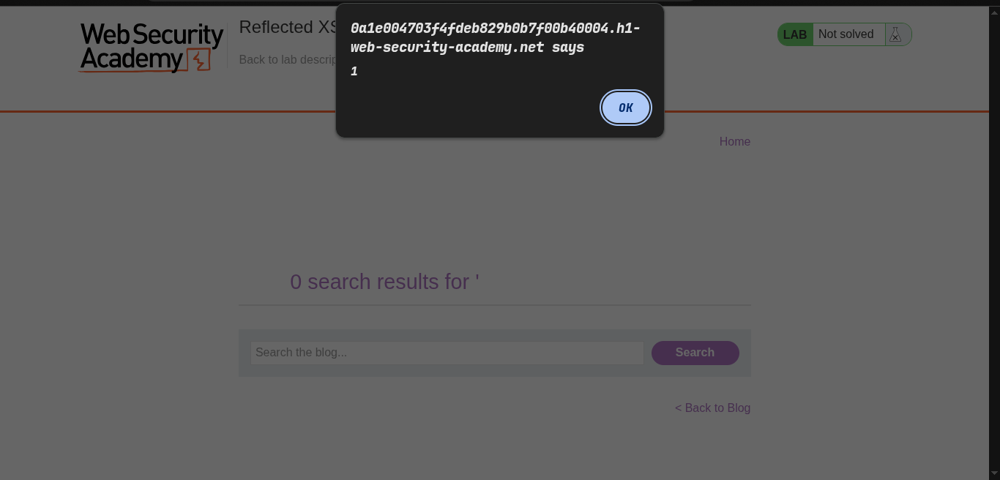
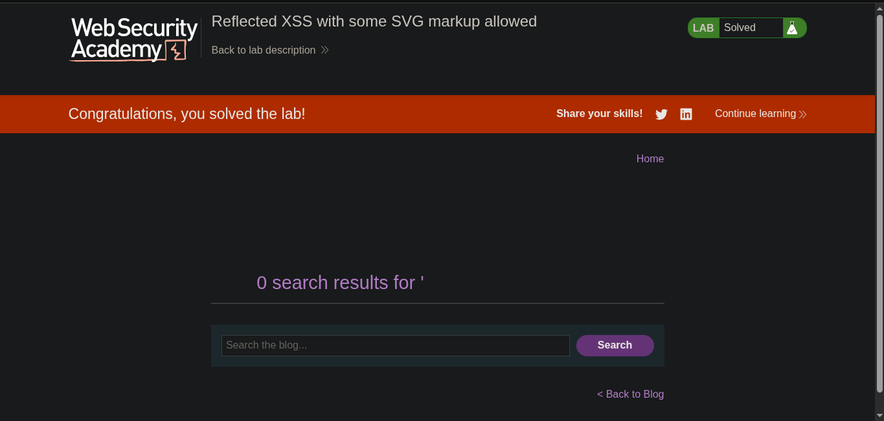

>> Platform  -> portswigger
>> ### Target -> Lab: Reflected XSS with some SVG markup allowed 

----
**Where is vuln search field**
**Goal alert(1)**

----

### Steps :
1. -> open the lab
2. -> check where is vuln try in seaarch field vunilla xss alert -> 
3. -> tags are blocked.
4. -> try svg tag -> 
5. -> but event is block 
6. -> now Fuzz event in burp pro intruder -> 
7. -> 
8. -> after hit and try this payload work -> begin event only work svg animatetransform
```html
<svg><animatetransform onbegin=alert(1) attributeName=transform>
<!-- use xss cheat sheet for this payloads provided by portswigger -->
```
9.  -> final execution -> 
    - 
10. lab solve -> 
