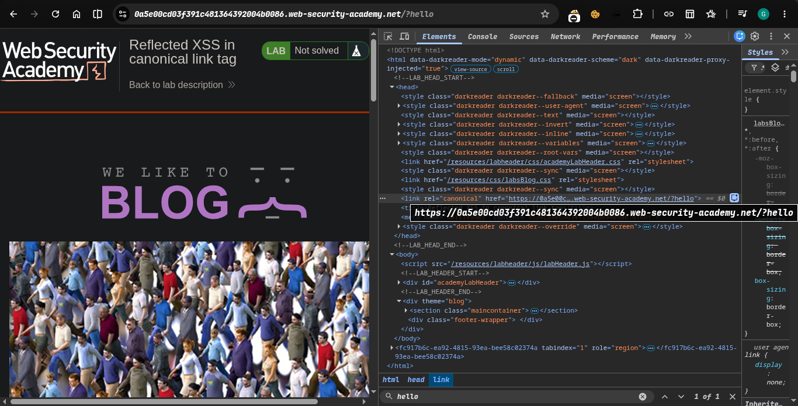
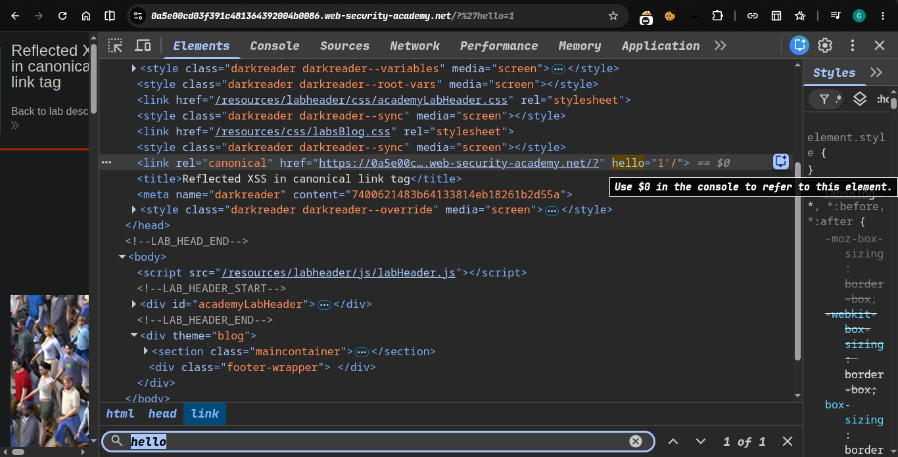
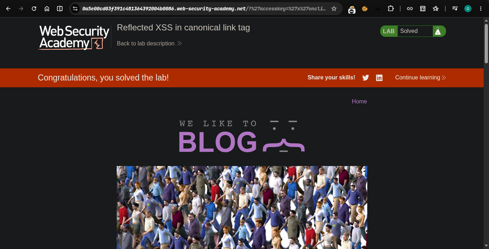

>> platform -> portswigger
>>> #### target -> Lab: Reflected XSS in canonical link tag

----
**Where is vuln in url endpoint**
**Goal alert(1)**

----


###  steps:
1. #### open the Lab.
  -  trigger simple hello 
2. -> try this 
3. -> bypass this
```javascript
?'accesskey='x'onclick='alert(1)
```
1.  payload hit........
2. lab solve.....
