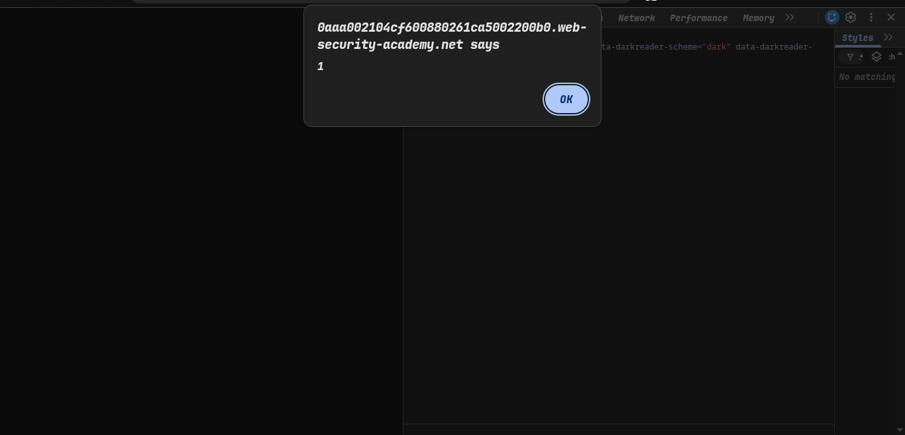
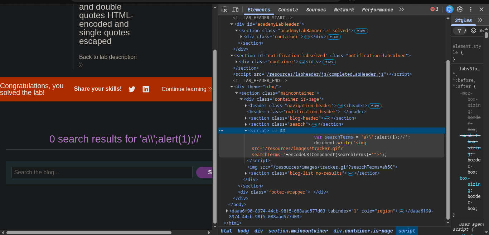

>>> Platform -> Portswigger
>> Target -> Lab: Reflected XSS into a JavaScript string with angle brackets and double quotes HTML-encoded and single quotes escaped

----
**Where is Vuln:**
**Goal**

----

### Steps:
1. Open the Lab....
2. now i'm try this escaping ``` a\';alert(1);//``
3. 
4. 
5. solve the lab
