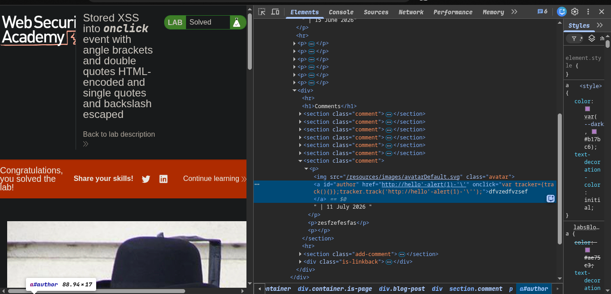

> > > Platform -> portswigger
> > > Target -> Lab: Stored XSS into `onclick` event with angle brackets and double quotes HTML-encoded and single quotes and backslash escaped

---

**Vulnerability:** Stored XSS in the blog comment section
**Goal:** Bypass the filter and trigger an alert

---

### Why this payload works

The application stores your input and later places it into an event handler such as an `onclick` attribute. The filter blocks angle brackets and double quotes, and also escapes single quotes and backslashes, so a normal payload will not work.

The trick is to use HTML entity encoding:

- `&#x27;` is decoded by the browser into `'`
- That single quote breaks out of the original quote context
- `alert(1)` then runs as JavaScript
- The extra `&#x27;` and trailing `'` help keep the syntax valid

### Payload

```html
http://hello&#x27;-alert(1)-&#x27;'
```

### Payload breakdown

- `http://hello` → harmless text
- `&#x27;` → becomes `'` after HTML decoding
- `-alert(1)-` → injected JavaScript
- `&#x27;` → another `'` to balance the syntax
- final `'` → closes the remaining quote context

### Steps

1. Open the lab.
2. Post a comment containing the payload.
3. Trigger the event to execute the JavaScript.
4. The alert should appear and the lab is solved.
