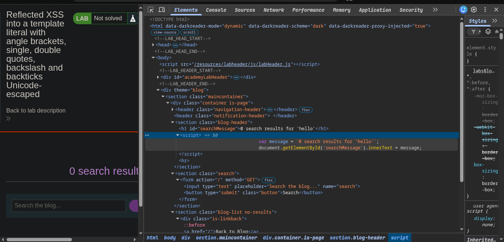
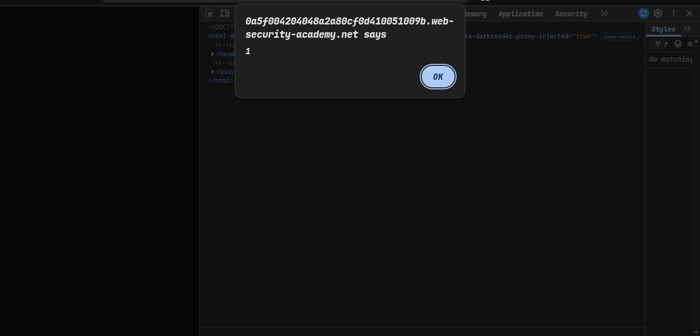
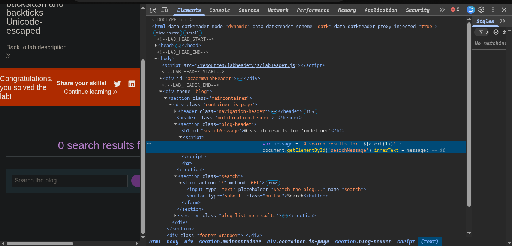

>>> #### Platform -> portswigger
>>> Target -> Lab: Reflected XSS into a template literal with angle brackets, single, double quotes, backslash and backticks Unicode-escaped


----
***Where is Vuln search blog***
***Goal trigger alert using template literal***

-----
------------------------------------------------------
>>> ### What  is template literal

## Template Literals in JavaScript

Template literals are strings created using backticks (`` ` ``) instead of regular quotes, allowing you to embed variables/expressions directly using `${}` syntax — no need for string concatenation (`+`).

**Bonus:** They also support multi-line strings naturally, without needing `\n`.

```js
const name = "Rahul";
const greeting = `Hello, ${name}!
Welcome.`;
```
-----------------------

### Steps:
1. Open the lab.
2. search simple hello analyze our hello inspect ->   our hello in `backticks`
3. exploiting with
```javascript
${alert(1)}
```
4. solve the lab 
### 
